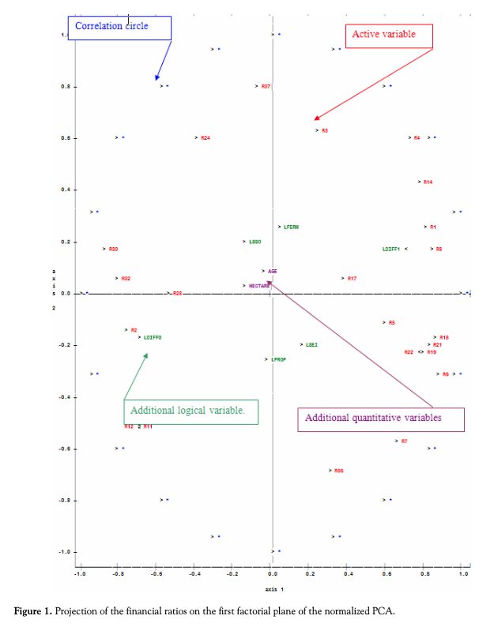
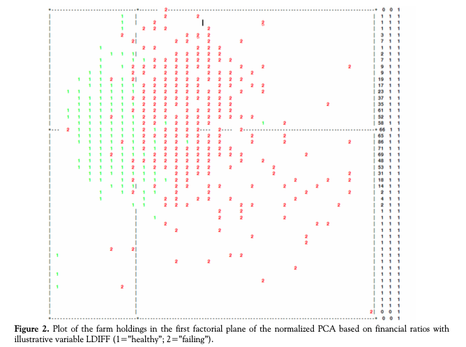
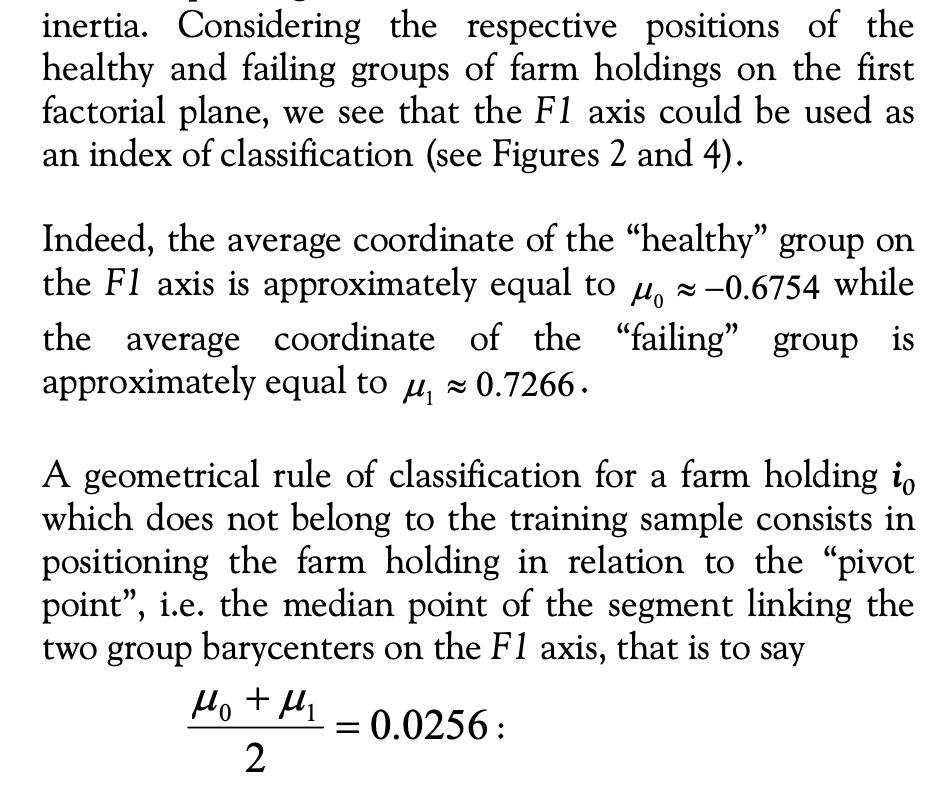
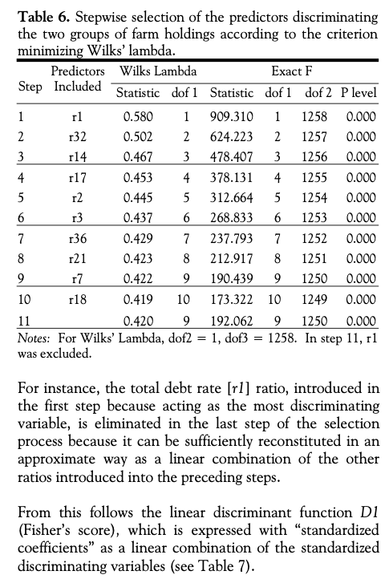
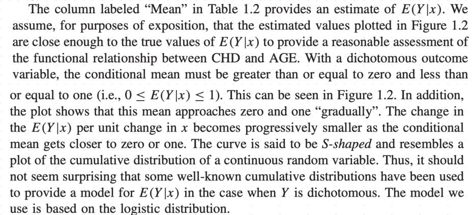
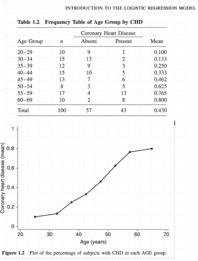
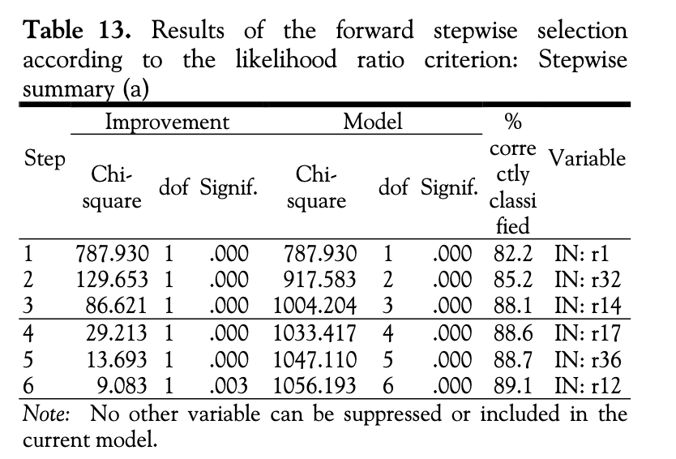
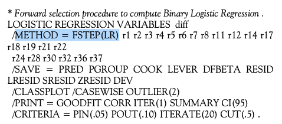
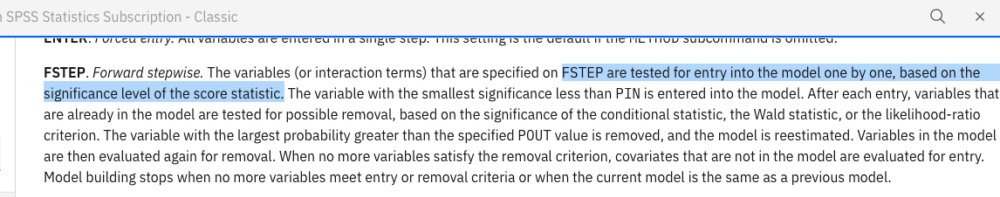
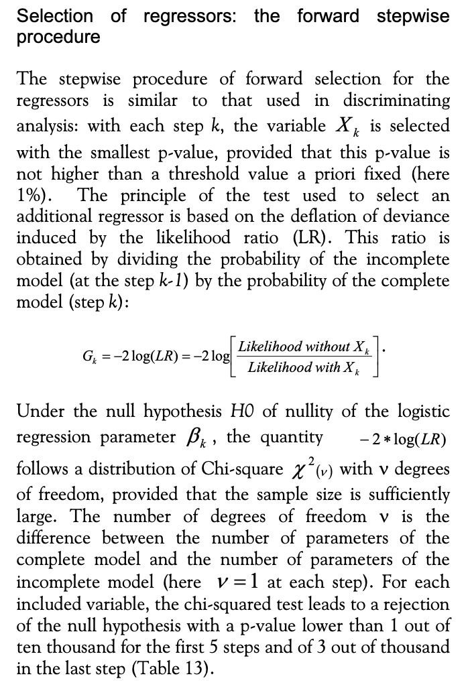

# The Farm holding/Desbois Case Study

## Context

The article from @desbois2008 (available [here](https://csbigs.fr/index.php/csbigs/article/view/351.html) together with a sample data set) presents a complete case study around the detection of financial risks for **farm holdings** in France.

Among other methods, Linear Discriminant Analysis and Logistic Regression (plus a stepwise variable selection procedure) are used. ROC curves are provided to compare the methods.

We will reproduce and extend the Desbois case study throughout this course as a **running example** ("fil rouge"). At each stage, we apply the concepts introduced in the preceding handout.

::: callout-tip
## What you'll do in this Part 1

Following the concepts from [Handout 1: Scoring](../handouts/1_scoring.qmd):

1.  Load and explore the Desbois dataset
2.  Understand the 37 financial ratios used as predictors
3.  Perform PCA on financial ratios and discover that even this unsupervised method separates defaulting farms
4.  Use the first principal component as a **naive scoring function**
5.  Evaluate it with a ROC curve
:::

# Data

## Loading

Loading Desbois data and first glimpse at it:

```{r}
#| echo: true
#| code-fold: show
#| warning: false

library(tidyverse)
# package used to import spss file
library(foreign)

don_desbois <- read.spss("../data/presentation_data/Agriculture Farm Lending/desbois.sav", to.data.frame = TRUE) %>% as_tibble()
glimpse(don_desbois)
```

Replacing for convenience `DIFF` target by factor `Y` with `O` (healthy) or `1` (failing):

```{r}
#| echo: true
#| code-fold: show
#| warning: false

don_desbois <- don_desbois %>%
    mutate(Y = as.factor(if_else(DIFF=='healthy', 0, 1)), DIFF = NULL,
           .before = everything())

```

Your turn to play

Using the data set at hand, try to retrieve some findings of the Desbois case study.

You might need `R` packages `FactoMineR`, `ROCR` and `MASS::lda` function to perform the tasks ("YOUR CODE HERE") described in the following slides.

Each time I show an example of what is expected.

I suggest that you start using `Quarto` (setup [here](https://quarto.org/docs/get-started/)) to code and track/publish your results. It will be requested for your projects (it is very similar to `RMarkdown`). It integrates perfectly with `RStudio`.

Principal Component Analysis (PCA) of financial ratios

First perform PCA on financial ratios (use for example package [FactoMineR](http://factominer.free.fr/factomethods/principal-components-analysis.html)), then display correlations between ratios and the two first principal components :

```{r}
#| echo: true
#| code-fold: show
#| warning: false

########## YOUR CODE HERE #####################
```

```{r}
#| code-fold: true
# More details here http://factominer.free.fr/factomethods/principal-components-analysis.html
res.pca = FactoMineR::PCA(don_desbois,
                          scale.unit = TRUE,
                          quanti.sup = c(4, 7), # HECTARE / AGE excluded from Farm holding analysis
                          quali.sup = c(1, 2, 3, 5, 6, 8), 
                          ncp = 5,
                          graph=FALSE)
plot(res.pca, choix = "var")
# FactoMineR::dimdesc(res.pca, axes=c(1,2))
```

To be compared with article Figure 1

{.r-stretch}

Following Desbois path, visualize the farm holdings in data set as a bivariate plot on the first two components of PCA (based on financial ratios), use variable Y (0=”healthy”; 1=”failing”) to colour your observations:

```{r}
#| echo: true
#| code-fold: show
#| warning: false

########## YOUR CODE HERE #####################
```

```{r}
#| code-fold: true
# Similar to D. Desbois Fig 2. 
# Plot of the farm holdings in the first factorial plane of the normalized PCA based on financial ratios
# with illustrative variable Y (0=”healthy”; 1=”failing”)
FactoMineR::plot.PCA(res.pca, axes=c(1, 2), choix="ind", habillage=1, invisible = c("quali"))
```

To be compared with article Figure 2

It strikes Desbois that the PCA (even if not a discriminative/scoring procedure), seems to do a rather good job identifying defaulting farms on the training set.

Disclaimer: in general it won't be necessarily the case as PCA operates only on the predictors without "knowledge" of target variable.

{.r-stretch}

As suggested by Desbois, extract the first principal component (some help [here](https://stats.stackexchange.com/questions/460787/pcr-after-pca-with-mixed-data-how-to-extract-export-the-pcs-as-new-variables-i)), and use it as a Scoring function.

Today it will allow us to use a first Scoring function without introducing the Logistic Regression that you have not yet studied in class.

```{r}
#| echo: true
#| code-fold: show
#| warning: false

########## YOUR CODE HERE #####################
```

Looking at this plot Desbois concludes that a simple classifier can be devised using the first PCA coordinate as a classifier (setting a threshold at $PC_1 > 0.02$):

{.r-stretch}

We show below how to obtain the first five Principal components (D. Desbois only uses the first two):
```{r}
#| echo: true
#| code-fold: show
#| warning: false
# https://stats.stackexchange.com/questions/460787/pcr-after-pca-with-mixed-data-how-to-extract-export-the-pcs-as-new-variables-i
# https://stats.stackexchange.com/questions/494866/how-to-explain-the-numerical-discrepancy-between-factominerpca-and-the-svd
# https://stats.stackexchange.com/questions/134282/relationship-between-svd-and-pca-how-to-use-svd-to-perform-pca

# Extracting first five Principal components from FactomineR object 
# Using FactomineR 'notation' (U,sv,V)
# (X nxp matrix of D. Desbois observations (only r1...r37), SVD decomposition X = U %*% diag(vs) %*% t(V), 
# where U: unitary matrix of left-singular vectors, vs: singular values, V: unitary matrix of left-singular vectors)
# SVD object from FactomineR res.pca$svd

# Principal components X %*% V = U %*% diag(vs) %*% t(V) %*% V = U %*% diag(vs) 
principal_components_1 <- res.pca$svd$U %*% diag(res.pca$svd$vs[1:5])

# Can also be directly extracted from:
principal_components_2 <- res.pca$ind$coord

# Or using PC = X %*% V (where X has been centered and scaled
# base R 'scale' uses a different scaling factor than FactomineR hence sqrt(n / n-1) correction)
X_for_PCA <- don_desbois %>% select(r1:r37) %>% as.matrix()
principal_components_3 <- sqrt(nrow(X_for_PCA) / (nrow(X_for_PCA) - 1)) * scale(X_for_PCA) %*% res.pca$svd$V
# perform svd using base R on scaled matrix
s <- svd(scale(X_for_PCA))
# correct for negative signs
s$v[, c(2, 3, 4, 5)] <- s$v[, c(2, 3, 4, 5)] * -1
V <- s$v[,1:5]
principal_components_4 <- sqrt(nrow(X_for_PCA) / (nrow(X_for_PCA) - 1)) * scale(X_for_PCA) %*% V
```

Below we define the score for each observation $x$ as the first principal component $PC_1(x)$ (x-coordinate below, with $PC_2(x)$ as y-coordinate):
```{r}
#| echo: true
#| code-fold: show
#| warning: false
naive_score <-  bind_cols(don_desbois, as_tibble(principal_components_2))
ggplot(naive_score) +
    geom_point(aes(x = Dim.1, y = Dim.2, col = Y)) +
    scale_colour_manual(values = c("dodgerblue", "orange"))
  
```
Defaulting farms or observations $x$ appear in orange, healthy in blue.


Going further than Desbois and for illustrative purposes only, use $PC_1$ as a very naive Scoring function.

Plot below the ROC curve as defined in the Scoring part of the presentation (you can use package `ROCR`, but a simple for-loop for different cutoff values $s$ will do the job):

```{r}
#| echo: true
#| code-fold: show
#| warning: false

########## YOUR CODE HERE #####################
```

```{r}
#| echo: true
#| code-fold: show
#| warning: false
library("ROCR")    

# naive score
pred <- prediction(naive_score$Dim.1, naive_score$Y)
perf <- performance(pred, measure = "tpr", x.measure = "fpr")
plot(perf, main="ROC curve", xlab="Specificity",
     ylab="Sensitivity", col = "darkorange", 
     print.cutoffs.at = c(-2.5,-1,0.00,1,5), 
     cutoff.label.function = function(x) {paste0("              s = ",round(x,2))})
abline(0, 1) #add a 45 degree line
```

ROC curve from scratch/definition:
For a given threshold $s$ and passing as argument a column of outputs $Y$ together with a score column we define a function to obtain the False/True Positive Rates (ie $(x(s),y(s))$ coordinates):

```{r}
#| echo: true
#| code-fold: show
#| warning: false
roc_curve <- function(s, error_rate){
    # error_rate is a tibble containing a column Y of true values and a column of score/probabilities 
    # let s be a threshold in R
    output <- factor(error_rate %>% pull(Y), levels = c(0,1))
    
    # classify using model probabilities (ie the score) and the threshold s
    classifier <- error_rate %>%
        mutate(classifier = factor(if_else(score>=s, 1, 0), levels = c(0,1))) %>% 
        pull(classifier)

    # build the confusion matrix and ROC curve coordinates for the given s
    # (x(s) = false_positive_rate, y(s) = true_positive_rate)
    conf_mat <- table(output, classifier)
    #       classifier
    # output    0       1
    #      0   TN       FP
    #      1   FN       TP

    true_negative <- conf_mat[1,1]
    false_positive <- conf_mat[1,2] 
    false_negative <- conf_mat[2,1]
    true_positive <- conf_mat[2,2]
    
    false_positive_rate <- false_positive / (false_positive + true_negative) 
    true_positive_rate <- true_positive / (false_negative + true_positive) # aka sensitivity
    return(tibble(threshold = s, fpr = false_positive_rate, tpr = true_positive_rate))
}
```

We then use this `roc_curve` function to plot the ROC curve (passing a vector of thresholds $s$) for our naive Score:

```{r}
#| echo: true
#| code-fold: show
#| warning: false
# Format Score/Target to our ROC curve function expected input
naive_error_rate <- tibble(score=naive_score$Dim.1, Y=naive_score$Y)

# We vary s in [-10, 15] to compute the ROC parametric curve 
roc_coordinates <- list()

for (s in seq(-10, 15, 0.25)){
    roc_coordinates <- append(roc_coordinates,
                                    list(roc_curve(s, naive_error_rate)))
}
roc_coordinates <- bind_rows(roc_coordinates)

ggplot(roc_coordinates, aes(x=fpr, y = tpr)) + geom_line()

```

We follow closely the case study, but we will see that ROC curves are usually evaluated on a hold-out data set.

Then compare with a Scoring function obtained with Linear Discriminant Analysis (LDA). For a reminder on LDA see for example @hastie2009 [chap. 4.3 LDA, p. 103-111].

You can use Desbois variables selected in the article by a stepwise procedure (using Wilk's lambda[^1]). Selected variables are:

[^1]: We won’t describe the procedure here. A SPSS script is given in the article. It is not straightforward to reproduce it with R. I tried scripting manually the procedure and it works but is not very interesting.

{.r-stretch}

So basically you can fit LDA with `r2+r3+r7+r14+r17+r18+r21+r32+r36` as predictors (I use `R` formula notation to ease your copy-paste).

Fit LDA (`MASS::lda`) with model specification of your choice. Then display model coefficients:

```{r}
#| echo: true
#| code-fold: show
#| warning: false

########## YOUR CODE HERE #####################
```

Using `r2+r3+r7+r14+r17+r18+r21+r32+r36`, we obtain LDA coefficients:

```{r}
#| echo: true
#| code-fold: show
#| warning: false

lda_desbois <- MASS::lda(Y~r2+r3+r7+r14+r17+r18+r21+r32+r36, data=don_desbois)
round(lda_desbois$scaling,3)
```

And if needed the same constant as in D. Desbois can be obtained:

```{r}
#| echo: true
#| code-fold: show
#| warning: false
# https://stats.stackexchange.com/questions/166942/why-are-discriminant-analysis-results-in-r-lda-and-spss-different-constant-t
groupmean<-(lda_desbois$prior%*%lda_desbois$means)
constant<-(groupmean%*%lda_desbois$scaling)
round(-constant,3)
```

Now compare the LDA Scoring function with the naive Score build with first component of PCA using a ROC curve (on training set):

```{r}
#| echo: true
#| code-fold: show
#| warning: false

########## YOUR CODE HERE #####################
```

ROC curve using `ROCR` package:
```{r}
#| echo: true
#| code-fold: show
#| warning: false

# for ROCR
labels_desbois <- don_desbois$Y

# naive score
predictions_naive_score <- naive_score$Dim.1

naive_score_group <- naive_score %>%
  group_by(Y) %>%
  summarize(mean_score = mean(Dim.1), n = n())

cutoff_naive <- mean(naive_score_group$mean_score)

pred <- prediction(predictions_naive_score, labels_desbois)
perf <- performance(pred, measure = "tpr", x.measure = "fpr")
plot(perf, main="ROC curve Admissions", xlab="Specificity",
     ylab="Sensitivity", col = "darkolivegreen", 
     print.cutoffs.at = c(cutoff_naive), 
     cutoff.label.function = function(x) {paste0("                s = ",round(x,2))})
abline(0, 1) #add a 45 degree line

# lda
predictions_lda <- predict(lda_desbois)$x

lda_score_group <- bind_cols(don_desbois, predictions_lda) %>%
  group_by(Y) %>%
  summarize(mean_score = mean(LD1), n = n())

cutoff_lda <- mean(lda_score_group$mean_score)

pred <- prediction(predictions_lda, labels_desbois)
perf <- performance(pred, measure = "tpr", x.measure = "fpr")
plot(perf, add = TRUE, main="ROC curve Admissions", xlab="Specificity",
     ylab="Sensitivity", col = "plum4",
     print.cutoffs.at = c(cutoff_lda), 
     cutoff.label.function = function(x) {paste0("                s = ",round(x,2))})
legend(0.6,0.6,
       c('naive - PCA', 'LDA'),
       col=c("darkolivegreen", "plum4"),lwd=3)
```


As a very soft and intuitive introduction to logistic regression. First discretize a ratio $r$ of your choice.

-   Compute proportion of defaults among each class. For example using $0.01$ steps for ratio $r17$:

```{r}
#| echo: true
#| code-fold: show
#| warning: false

########## YOUR CODE HERE #####################
```

```{r}
#| echo: true
#| code-fold: show
#| warning: false
class_width <- 0.01
don_desbois_binned <- don_desbois %>%
    mutate(r17_bins = cut(r17, breaks = seq(0, 0.2, class_width),
                              right = FALSE, dig.lab = 4, include.lowest = TRUE),
           min = floor(r17 / class_width) * class_width,
           max = if_else(r17 == 0 , 1, 
                         # customers with 0$ balance should belong to [0, width) class
                         # or be excluded
                         ceiling(r17 / class_width))  * class_width,
           max = if_else(min==max, (ceiling(r17 / class_width) + 1)  * class_width, max)) %>% 
    group_by(r17_bins, min, max, Y) %>% 
    summarize(n=n()) %>% 
    ungroup() %>% 
    pivot_wider(names_from = Y, values_from = n) %>%
    replace_na(list(`0` = 0, `1` = 0)) %>% 
    mutate(`Mean(Y)` = round(`1` / (`1` + `0`), 4))
cat(simplermarkdown::md_table(don_desbois_binned %>% select(r17_class=r17_bins, `0`, `1`,`Mean(Y)` )))
```

-   Then using this table, plot an empirical conditional distribution of default given $r$ classes:

```{r}
#| echo: true
#| code-fold: show
#| warning: false
 
########## YOUR CODE HERE #####################
```

```{r}
#| echo: true
#| code-fold: show
#| warning: false

(default_occurrence <- 
 ggplot(don_desbois %>% mutate(Y = if_else(Y == "1", 1, 0)), aes(x=r17, y=Y)) +
 geom_jitter(alpha=0.2, height=0.1) +
 geom_segment(data = don_desbois_binned,
              aes(x = min, xend = max, y = `Mean(Y)`, yend = `Mean(Y)`),
              color = 'coral',
              linewidth=1.25)) +
 scale_y_continuous(breaks = c(0, 1))
```

This roughly corresponds to the intuitive introduction to the logistic regression model given in @hosmer2013 using a Coronary Heart Disease (CHD) event as $Y$ and AGE as $X$:





```{r}
#| echo: true
#| code-fold: show
#| warning: false
(default_occurrence <- 
 ggplot(don_desbois %>% mutate(Y = if_else(Y == "1", 1, 0)), aes(x=r17, y=Y)) +
 geom_jitter(alpha=0.2, height=0.1) +
 geom_smooth(method = "glm", 
             formula = y ~ x,
             method.args = list(family = "binomial"), 
             se = FALSE,
             col = "dodgerblue",
             linetype = "dotted") +
 geom_segment(data = don_desbois_binned,
              aes(x = min, xend = max, y = `Mean(Y)`, yend = `Mean(Y)`),
              color = 'coral',
              linewidth=1.25)) +
 scale_y_continuous(breaks = c(0, 1))
```

::: callout-tip
## What you'll do in this Part 2

Following the concepts from [Handout 2: Logistic Regression](../handouts/2_logistic_regression.qmd):

0.  Perform EDA on the Desbois dataset. In particular.Understand the 37 financial ratios used as predictors
0.  Reuse the two scores from Part 1 (naive score based on PCA and LDA) as baselines
1.  Empirical odds of Failure (+given that the farmer OWNLAND Yes/No) / Empirical odds ratio
2.  Fit a Logistic Regression model with an intercept and a single qualitative predictor OWNLAND. Interpret the estimated coefficients
2.  Fit a Logistic Regression model with all variables in data set, interpret the r17 coefficient 
3.  Compare the Scoring function/Score obtained from Logistic Regression model to the LDA and naive Score built with first component of PCA (Part 1) using a ROC curve
4.  Perform statistical inference : Confidence intervals / Tests on logistic regression models (Wald, LRT) / Goodness of fit
5. Select model variables using forward stepwise procedure
6. Perform penalized logistic regression (Lasso) on the data set
7. Assess the models introduced before (naive Score, LDA, various Logistic Regression models) using resampling techniques (Hold-out and K-fold Cross Validation).

:::

## Logistic Regression

### Empirical odds

Using Farm holding data, compute (using a table for example):
- The empirical odds of failure
- The empirical odds of failure given that the farmer owns his land/farm or not

From the cross tabulation:

```{r}
#| echo: true
#| code-fold: show
#| warning: false
tab <- addmargins(table(Y=don_desbois$Y, OWNLAND=don_desbois$OWNLAND))
tab
```
we compute empirical odds:

- $\hat{Odds}(Y=1)=607/653=0.93$
- $\hat{Odds}(Y=1 \mid OWNLAND=Yes)=221/275\approx0.8$
- $\hat{Odds}(Y=1 \mid OWNLAND=No)=386/378\approx1.02$

### Empirical odds ratio

Compute / interpret the empirical odds ratios (OWNLAND Yes/No)

Empirical odds ratio:
$\hat{OR}_{Yes/No}(OWNLAND)= \frac{\frac{221}{275}}{\frac{386}{378}}\approx 0.787$

Interpretation:

- the odds of failing are multiplied by approx $0.787$ (alternatively divided by approx $1.27$) in the group of farmers owning their farm compared to farmers not owning their farm.
- the odds of not failing are multiplied by approx $1.27$ (alternatively divided by $0.787$) in the group of farmers owning their farm compared to farmers not owning their farm

### Estimated odds ratio

Fit a Logistic Regression model with an intercept and a single qualitative predictor OWNLAND. Interpret the estimated coefficient for OWNLAND.

We fit model with a single qualitative predictor OWNLAND:
```{r}
#| echo: true
#| code-fold: show
#| warning: false
glm_ownland <- glm(Y~OWNLAND, data=don_desbois, family = "binomial")
summary(glm_ownland)
```

The coefficient estimated for `OWNLANDyes` is $\beta_{\textrm{OWNLANDyes}}\approx$`r round(as.numeric(coef(glm_ownland)["OWNLANDyes"]),2)`. Hence owning its land decrease odds for default by a factor of ${OR}_{yes/no}(\textrm{OWNLAND})=\exp(\beta_{\textrm{OWNLANDyes}})\approx$ `r round(exp(as.numeric(coef(glm_ownland)["OWNLANDyes"])),3)`.

### Fitting / Coefficient interpretation

Fit a "full" Logistic Regression model with all predictors in data set, interpret the `r17` coefficient (in terms of probability and odds of failure):

```{r}
#| echo: true
#| code-fold: show
#| warning: false

########## YOUR CODE HERE #####################
```

```{r}
#| echo: true
#| code-fold: show
#| warning: false
# we fit a "full" model with all available predictors 
glm_full <- glm(Y~., data = don_desbois, family=binomial())
summary(glm_full)$coefficients[c(1,20:41),]
```

The estimated coefficient for `r17` is approx `r round(as.numeric(coef(glm_full)["r17"]),2)`. An increase of `r17` by $0.01$ increases odds for default by a factor $\exp(\beta_{r_{17}}\times 1\%)=$ `r round(exp(as.numeric(coef(glm_full)["r17"])*0.01),2)`.


### Confidence interval

Build a confidence interval for financial ratio `r17` and `r36` using estimated coefficients and standard errors.

$$(\hat\beta-\beta)^TX^T W_{\hat\beta} X(\hat\beta-\beta) \xrightarrow[]{\mathcal L} \chi_p^2$$

Or equivalently:

$$\hat\beta -\beta \xrightarrow[]{\mathcal L} \mathcal N(0,\mathcal ( X^T W_{\hat\beta} X )^{-1})$$

Using the preceding asymptotic properties we can derive confidence interval and tests for the coefficients $\beta_j$, $j =1,\cdots,p$ of the model:

$$\frac{\hat\beta_j-\beta_j}{\hat \sigma_j} \xrightarrow[]{\mathcal L} \mathcal N(0,1)$$
where $\hat \sigma_j^2= s.e.(\hat\beta_j)^2$ denotes the $j-th$ term of $( X^T W_{\hat\beta} X )^{-1}$ diagonal.

The typical formula for a $1-\alpha$ confidence interval is:

$$\hat\beta_j \pm z_{1-\alpha/2} \hat \sigma_j$$
where $z_{1-\alpha/2}$ is the $(1-\alpha/2)$ quantile of the standard normal distribution.

Confidence interval for $r_{17}$ and $r_{36}$ coefficients at $95\%$ level, using Wald statistics:

```{r}
#| echo: true
#| code-fold: show
#| warning: false
confint.default(glm_full)[c(31,40),]
```

We can retrieve it manually using coefficient estimate and standard deviation, for $r_{17}$:

```{r}
#| echo: true
#| code-fold: show
#| warning: false
output = summary(glm_full)$coefficients
r17_estimate <- output[31,1]
r17_std_error <- output[31,2]
# using 97.5 / 2.5 percentile points for the standard normal (approx +/- 1.96)
# upper bound for beta(r17) at 95%
upper <- r17_estimate + 1.96 * r17_std_error
# lower bound for beta(r17) at 95%
lower <- r17_estimate - 1.96 * r17_std_error
(r17_confint <- c(lower, upper))
```


### Tests

Considering the "full" model `Y~.`, assess the statistical significance of `r36`? Using Wald test. Using Likelihood Ratio Test. 

#### Wald Test

The asymptotic properties of MLE also allow to test the "statistical significance" of each coefficient in the model with the Wald test.

Denoting: $\textrm{H}_0\textrm{: } \beta_j=0$ and $\textrm{H}_1\textrm{: } \beta_j \neq 0$ we have under $\textrm{H}_0$:

$$\frac{\hat\beta_j}{\hat \sigma_j} \xrightarrow[]{\mathcal L} \mathcal N(0,1)$$
We will reject $\textrm{H}_0$ at level $\alpha$ if the absolute of the observed value $\frac{\hat\beta_j}{\hat \sigma_j}$ (denoted in `glm` output as `z value`) is above the $(1-\alpha/2)$ quantile of the standard normal distribution. 

This is the z-test (or Student test) that is shown in the output of the `glm` regression table

Equivalently:

$$\left(\frac{\hat\beta_j}{\hat \sigma_j}\right)^2 \xrightarrow[]{\mathcal L} \chi^2(1)$$

We will reject $\textrm{H}_0$ at level $\alpha$ if the observed value of $\left(\frac{\hat\beta_j}{\hat \sigma_j}\right)^2$ (the square of the `z value` in `glm` output, known as the Wald statistic) is above the $(1-\alpha)$ quantile of the Chi-squared distribution with 1 degree of freedom.

```{r}
#| echo: true
#| code-fold: show
#| warning: false
# YOUR CODE HERE
```

This is the Wald test.

Student test for predictor $r_{36}$ reading the `glm` output table:

```{r}
#| echo: true
#| code-fold: show
#| warning: false
summary(glm_full)
```

```{r}
#| echo: true
#| code-fold: show
#| warning: false
sum_desbois <- summary(glm_full)
sum_desbois$coefficients[40,]
```

Performing Wald test with the dedicated routine `aod::wald.test`:
```{r}
#| echo: true
#| code-fold: show
#| warning: false
# Testing the r36 coefficient (Terms = 40)
aod::wald.test(b = coef(glm_full), Sigma = vcov(glm_full), Terms = 40)
```

Performing Wald test with the dedicated routine `car::Anova`:
```{r}
#| echo: true
#| code-fold: show
#| warning: false
# Testing all variables, extracting r36
car::Anova(glm_full, type=3, test.statistic="Wald")[29,]
```

Performing Student/Wald test "manually":
```{r}
#| echo: true
#| code-fold: show
#| warning: false
# Extracting fitted coefficients(beta)/standard errors (from hessian matrix)
beta_r17 <- sum_desbois$coefficients[40,1]
std_err_r17 <- sum_desbois$coefficients[40,2]
# Wald statistics (chi-squared with 1 df)
# See https://stats.stackexchange.com/users/930/chl),
# Calculating quantiles for chi squared distribution,
wald <- (beta_r17 / std_err_r17) ^ 2
1-pchisq(wald, df = 1)

# Equivalent Z-test or Student test (two-tailed, standard normal)
# z_val <- beta_r17 / std_err_r17
z_val <- sum_desbois$coefficients[40,3]
2*(1-pnorm(abs(z_val)))
```

#### LRT Test


Likelihood Ratio test for predictor $r_{36}$ using  dedicated `anova` function. To perform such test we have to fit two nested model (the "full" one, and a nested one having removed predictor  $r_{36}$):

```{r}
#| echo: true
#| code-fold: show
#| warning: false
# using anova on two models (with/without  r36)
glm_wo_r36 <- glm(Y~., data = don_desbois %>% select(-r36), family=binomial())
anova(glm_wo_r36, glm_full, test= "LRT")
```

```{r}
#| echo: true
#| code-fold: show
#| warning: false
# Manually, building the statisitcs using model deviances:
LRT <- -2 * (logLik(glm_wo_r36)-logLik(glm_full))
# Then using chisq(df=1) density/quantiles to get p-value:
pval <- 1 - pchisq(LRT, df = 1)
scales::scientific(pval, digits = 3)
```


Fit a "reduced" model with 9/10 financial ratios (including `r17` and `r36`) as predictors. Fit a "smaller" model removing `r17` and 2/3 additional ratios of your choice. Compare using LRT the two model fit, which one would you retain?

```{r}
#| echo: true
#| code-fold: show
#| warning: false
# YOUR CODE HERE
```

We fit a "reduced" model with a subset $\{r_2,\dots,r_{36}\}$ of financial ratios as in the Farm holding case study Table 7:

```{r}
#| echo: true
#| code-fold: show
#| warning: false
glm_reduced <- glm(Y~r2+r3+r7+r14+r17+r18+r21+r32+r36, data=don_desbois, family = "binomial")
summary(glm_reduced)
```

We fit a "smaller" model with $r_{17}, r_{21}, r_{36}$ removed from model specification:

```{r}
#| echo: true
#| code-fold: show
#| warning: false
glm_smaller <- glm(Y~r2+r3+r7+r14+r18+r32, data=don_desbois, family = "binomial")
summary(glm_smaller)
```

We compare the two models using a likelihood ratio test (LRT):

```{r}
#| echo: true
#| code-fold: show
#| warning: false
anova(glm_smaller, glm_reduced, test= "LRT")
```

"reduced" model provides a statistically significant improvement over "smaller" model ($\chi^2(3) = 24.92, p < 0.001$). Keeping $r_{17}, r_{21}, r_{36}$ reduces residual deviance by $24.9$ points for only 3 additional degrees of freedom, justifying the more complex model according to the LRT.

#### Scoring functions comparison with ROC curves
Below we compare, using the whole training set (bad practice), the Scoring functions obtained with Logistic Regression ("full" and "reduced" models), with the LDA fitted in Part 1 (using same predictors as the "reduced" model) and the naive Score built with first principal component of PCA: 

```{r}
#| echo: true
#| code-fold: show
#| warning: false
# for ROCR
labels_desbois <- don_desbois$Y

# Naive score
res.pca = FactoMineR::PCA(don_desbois,
                          scale.unit = TRUE,
                          quanti.sup = c(4, 7), # HECTARE / AGE excluded from Farm holding analysis
                          quali.sup = c(1, 2, 3, 5, 6, 8), 
                          ncp = 5,
                          graph=FALSE)

principal_components <- res.pca$ind$coord
naive_score <-  bind_cols(don_desbois, as_tibble(principal_components))
# naive score / scoring function is the first principal component of predictors PC1
predictions_naive_score <- naive_score$Dim.1
# getting a specific threshold/cutoff for the score using the average value for PC1 in training set
naive_score_group <- naive_score %>%
  group_by(Y) %>%
  summarize(mean_score = mean(Dim.1), n = n())
cutoff_naive <- mean(naive_score_group$mean_score)
# plot with ROCR
pred <- prediction(predictions_naive_score, labels_desbois)
perf <- performance(pred, measure = "tpr", x.measure = "fpr")
plot(perf, main="ROC curve Admissions", xlab="Specificity",
     ylab="Sensitivity", col = "darkolivegreen", 
     print.cutoffs.at = c(cutoff_naive), 
     cutoff.label.function = function(x) {paste0("                s = ",round(x,2))})
abline(0, 1) #add a 45 degree line, random curve

# LDA
lda_desbois <- MASS::lda(Y~r2+r3+r7+r14+r17+r18+r21+r32+r36, data=don_desbois)
# Scoring function for LDA (predict$x contains the scores of test cases)
predictions_lda <- predict(lda_desbois)$x

lda_score_group <- bind_cols(don_desbois, predictions_lda) %>%
  group_by(Y) %>%
  summarize(mean_score = mean(LD1), n = n())
# getting a specific threshold/cutoff for the score using the average value in training set
cutoff_lda <- mean(lda_score_group$mean_score)
# plot with ROCR
pred <- prediction(predictions_lda, labels_desbois)
perf <- performance(pred, measure = "tpr", x.measure = "fpr")
plot(perf, add = TRUE, main="ROC curve Admissions", xlab="Specificity",
     ylab="Sensitivity", col = "plum4",
     print.cutoffs.at = c(cutoff_lda), 
     cutoff.label.function = function(x) {paste0("                s = ",round(x,2))})


#lr reduced
glm_reduced <- glm(Y~r2+r3+r7+r14+r17+r18+r21+r32+r36, data=don_desbois, family = "binomial")
# Scoring function for Log Reg (ie predicted by the fitted Logistic curve)
glm_predict <- predict(glm_reduced, type="response")
# Using the bayesian classifier cutoff
cutoff_lr <- 0.5
# plot with ROCR
pred <- prediction(glm_predict, labels_desbois)
perf <- performance(pred, measure = "tpr", x.measure = "fpr")
plot(perf, add = TRUE, main="ROC curve", xlab="Specificity",
     ylab="Sensitivity", col = "coral2",
     print.cutoffs.at = c(cutoff_lr), 
     cutoff.label.function = function(x) {paste0("                s = ",round(x,2))})

#lr full
glm_predict <- predict(glm_full, type="response")
cutoff_lr <- 0.5
pred <- prediction(glm_predict, labels_desbois)
perf <- performance(pred, measure = "tpr", x.measure = "fpr")
plot(perf, add = TRUE, main="ROC curve", xlab="Specificity",
     ylab="Sensitivity", col = "dodgerblue",
     print.cutoffs.at = c(cutoff_lr), 
     cutoff.label.function = function(x) {paste0("                s = ",round(x,2))})
legend(0.6,0.6,
       c('naive - PCA', 'LDA  - r2:r36', 'Logistic Regression - r2:r36', 'Logistic Regression - full'),
       col=c("darkolivegreen", "plum4", "coral2", "dodgerblue"),lwd=3)

```


#### Goodness of fit tests

Perform a goodness of fit test (Hosmer and Lemeshow) and a calibration plot, compare.

```{r}
#| echo: true
#| code-fold: show
#| warning: false
# YOUR CODE HERE
```

We perform a Hosmer-Lemeshow test for the "reduced" model using `glmtoolbox::hltest`.

```{r}
#| echo: true
#| code-fold: show
#| warning: false
glmtoolbox::hltest(glm_reduced)
```

Here the p-value for a chi-squared statistic of $H\approx17.14$ with $df=Q-2=8$ is $p\approx0.029$ which is well bellow the usual levels (eg $0.05$), so that the null hypothesis is rejected, goodness of fit is not acceptable according to the H&L test.
NB: the Hosmer Lemeshow test might flag differences that are not practically meaningful, in particular it is known to be sensitive to sample size and how bins are defined.

We perform a Hosmer-Lemeshow test for the "smaller" model using `glmtoolbox::hltest`.

```{r}
#| echo: true
#| code-fold: show
#| warning: false
glmtoolbox::hltest(glm_smaller)
```

Here the p-value for a chi-squared statistic of $H\approx15.96$ with $df=Q-2=8$ is $p\approx0.043$ which is just bellow the usual levels (eg $0.05$), so that the null hypothesis is again rejected, goodness of fit is not acceptable according to the H&L test.

We roughly tweak the model (in particular winsorizing the financial ratios to cope with outliers):

```{r}
#| echo: true
#| code-fold: show
#| warning: false
glm_wins <- glm(Y ~ OWNLAND + STATUS + HECTARE + r1 + r3 + r8 + r12 + r14 + r17 + r28 + r36, 
                data = don_desbois %>%
                 mutate(across(r1:r37, ~ DescTools::Winsorize(.x , quantile(.x, probs = c(0.025, 0.975))))),
                 family = "binomial")
glmtoolbox::hltest(glm_wins)
```

Here the p-value for a chi-squared statistic of $H\approx3.29$ with $df=Q-2=8$ is $p\approx0.91$ which is above the usual levels (eg $0.05$), so that the null hypothesis is not rejected, goodness of fit is acceptable according to the H&L test.

We prepare the coordinates for the Calibration Plot of the "reduced" model:
binning modelled/fitted probabilities (10 Groups), then averaging the fitted and observed probabilities in these groups.

```{r}
#| echo: true
#| code-fold: show
#| warning: false
check_default_prob <- as_tibble(cbind(fitted=glm_reduced$fitted.values,
                                      Y = don_desbois %>% mutate(Y = if_else(Y == "1", 1, 0)) %>% pull(Y)))
# This is roughly what Hosmer Lemeshow test uses to build its statistic:                                        
(calibration_data <- check_default_prob %>%
  mutate(bins_prob = cut(fitted, breaks = quantile(fitted,seq(0,1,0.10)), include.lowest = TRUE)) %>%
  group_by(bins_prob) %>%
  summarize(n = n(),
            def = sum(Y),
            no_def = n - def,  
            predict_prob = mean(fitted),
            observed_prob = def/n,
            predicted_def = n*predict_prob))
```

We get a similar table as the one used by Hosmer-Lemeshow test (10 Groups).

Although the Hosmer–Lemeshow test rejects the goodness of fit/calibration for the "reduced" model, the calibration plot suggests deviations remain limited across the full range and could be acceptable for practical use:

```{r}
#| echo: true
#| code-fold: show
#| warning: false
(calib_plot <- ggplot(calibration_data, aes(x = predict_prob, y = observed_prob)) +
      geom_point() +
      geom_abline())
```

The model built using winsorized variables shows a better calibration:
```{r}
#| echo: true
#| code-fold: true
#| warning: false
check_default_prob <- as_tibble(cbind(fitted=glm_wins$fitted.values,
                                      Y = don_desbois %>%
                                        mutate(Y = if_else(Y == "1", 1, 0)) %>%
                                        pull(Y)))
# This is roughly what Hosmer Lemeshow test uses to build its statistic:                                        
calibration_data <- check_default_prob %>%
  mutate(bins_prob = cut(fitted, breaks = quantile(fitted,seq(0,1,0.10)), include.lowest = TRUE)) %>%
  group_by(bins_prob) %>%
  summarize(n = n(),
            def = sum(Y),
            no_def = n - def,  
            predict_prob = mean(fitted),
            observed_prob = def/n,
            predicted_def = n*predict_prob)
(calib_plot <- ggplot(calibration_data, aes(x = predict_prob, y = observed_prob)) +
      geom_point() +
      geom_abline())
```

## Model selection and assessment

### Stepwise Logistic Regression

Use forward stepwise selection based on the AIC criterion to select variables in the Farm holding data set. Compare with results from the article. Do you find the same variables as the author? (Extra, perform the same analysis using LDA/Wilks Lambda forward selection procedure as in the article).

```{r}
#| echo: true
#| code-fold: show
#| warning: false
# YOUR CODE HERE
```

Keeping only financila ratios:

```{r}
#| echo: true
#| code-fold: show
#| warning: false
data_afl <- don_desbois

#define intercept-only model
intercept_only <- glm(Y ~ 1, data=data_afl, family="binomial")

#define model with all predictors
# In Desbois only financial ratios are used
all <- glm(Y ~ ., data=data_afl %>% select(Y, starts_with('r')), family="binomial")

# We use all variables
# all <- glm(Y ~ ., data=data_afl , family="binomial")
```

```{r, warning=FALSE}
#| echo: true
#| code-fold: show
#| warning: false
# perform forward stepwise regression
forward_aic <- step(intercept_only, direction='forward', test = 'LRT', scope=formula(all), k=2, trace = FALSE)
summary(forward_aic)
```

We perform manually a likelihood-ratio-test-based forward selection (as described in Desbois) using only financial ratios as predictors.

```{r, warning = FALSE}
#| code-fold: show
all <- glm(Y ~ ., data=data_afl %>% select(Y, starts_with('r')), family="binomial")

first_step <- add1(intercept_only, scope = formula(all), test = "LRT")
first_step <- first_step %>% 
    tibble() %>%
    add_column(variable=row.names(first_step)) %>% 
    arrange(desc(LRT))
first_step
```

`r1` is the most significant variable in the first step based on likelihood-ratio-test.

```{r, warning = FALSE}
#| code-fold: show
second_step <- add1(update(intercept_only, ~. + r1), scope = formula(all), test = "LRT")
second_step <- second_step %>% 
    tibble() %>%
    add_column(variable=row.names(second_step)) %>% 
    arrange(desc(LRT))
second_step
```

`r21` is the most significant variable in the second step (it differs from the article where r32 is selected (p70, the r32 in R is the same as in article (129.65) but r21 and r14 have higher LRT)).

```{r, warning = FALSE}
#| code-fold: show
third_step <- add1(update(intercept_only, ~. + r1 + r21), scope = formula(all), test = "LRT")
third_step <- third_step %>% 
    tibble() %>%
    add_column(variable=row.names(third_step)) %>% 
    arrange(desc(LRT))
third_step
```

`r14` is the most significant variable in the third step.

```{r, warning = FALSE}
#| code-fold: show
fourth_step <- add1(update(intercept_only, ~. + r1 + r21 + r14), scope = formula(all), test = "LRT")
fourth_step <- fourth_step %>% 
    tibble() %>%
    add_column(variable=row.names(fourth_step)) %>% 
    arrange(desc(LRT))
fourth_step
```

`r17` is the most significant variable in the fourth step.

```{r, warning = FALSE}
#| code-fold: show
fifth_step <- add1(update(intercept_only, ~. + r1 + r21 + r14 + r17), scope = formula(all), test = "LRT")
fifth_step <- fifth_step %>% 
    tibble() %>%
    add_column(variable=row.names(fifth_step)) %>% 
    arrange(desc(LRT))
fifth_step
```

`r24` is the most significant variable in the fifth step.

```{r, warning = FALSE}
#| code-fold: show
sixth_step <- add1(update(intercept_only, ~. + r1 + r21 + r14 + r17 + r24), scope = formula(all), test = "LRT")
sixth_step <- sixth_step %>% 
    tibble() %>%
    add_column(variable=row.names(sixth_step)) %>% 
    arrange(desc(LRT))
sixth_step
```

`r11` is the most significant variable in the sixth step.

Equivalently the `step` routine produces the same results:

```{r, warning=FALSE}
#| code-fold: show
# perform forward stepwise regression
forward_aic <- step(intercept_only, direction='forward', test = 'LRT', scope=formula(all), k=2, trace = FALSE)
summary(forward_aic)
```

We now perform manual likelihood-ratio-test-based forward selection with override when needed to match the procedure of Desbois article (i.e. forcing the selection of the same variables as in Desbois if `R` procedure disagrees).

```{r, warning = FALSE}
#| code-fold: show
first_step_article <- add1(intercept_only, scope = formula(all), test = "LRT")
first_step_article <- first_step_article %>% 
    tibble() %>%
    add_column(variable=row.names(first_step_article)) %>% 
    arrange(desc(LRT))
head(first_step, 4)
```

`r1` is the most significant variable in the first step.

```{r, warning = FALSE}
#| code-fold: show
second_step_article <- add1(update(intercept_only, ~. + r1), scope = formula(all), test = "LRT")
second_step_article <- second_step_article %>% 
    tibble() %>%
    add_column(variable=row.names(second_step_article)) %>% 
    arrange(desc(LRT))
head(second_step,4)
```

In the article `r32` is the most significant variable in the second step: we force the selection of `r32` instead of `r21` proposed by `R`. We have exactly the same LRT as in the article:

```{r, warning = FALSE}
#| code-fold: show
third_step <- add1(update(intercept_only, ~. + r1 + r32), scope = formula(all), test = "LRT")
third_step <- third_step %>% 
    tibble() %>%
    add_column(variable=row.names(third_step)) %>% 
    arrange(desc(LRT))
head(third_step, 4)
```

Like in the article `r14` is the most significant variable in the third step (with same LRT).

```{r, warning = FALSE}
#| code-fold: show
fourth_step <- add1(update(intercept_only, ~. + r1 + r32 + r14), scope = formula(all), test = "LRT")
fourth_step <- fourth_step %>% 
    tibble() %>%
    add_column(variable=row.names(fourth_step)) %>% 
    arrange(desc(LRT))
head(fourth_step, 4)
```

In the article `r17` is the most significant variable in the fourth step: : we choose `r17`instead of `r18`.

```{r, warning = FALSE}
#| code-fold: show
fifth_step <- add1(update(intercept_only, ~. + r1 + r32 + r14 + r17), scope = formula(all), test = "LRT")
fifth_step <- fifth_step %>% 
    tibble() %>%
    add_column(variable=row.names(fifth_step)) %>% 
    arrange(desc(LRT))
head(fifth_step,4)
```

Like in the article `r36` is the most significant variable in the fifth step (with same LRT)

```{r, warning = FALSE}
#| code-fold: show
sixth_step <- add1(update(intercept_only, ~. + r1 + r32 + r14 + r17 + r36), scope = formula(all), test = "LRT")
sixth_step <- sixth_step %>% 
    tibble() %>%
    add_column(variable=row.names(sixth_step)) %>% 
    arrange(desc(LRT))
head(sixth_step, 4)
```

Like in the article `r12` is the most significant variable in the sixth step (with same LRT). The routine (`SPSS`) in the article stops with this six variables.

{fig-align="center" width="350"}

Looking at the Appendix of Desbois and `SPSS` documentation, it seems that the `SPSS` procedure `FSTEP` used by Desbois for the study performs a Rao score test instead of LRT so select the variables to entry the model (with a p-value threshold at 1%):

{fig-align="center" width="500"}

{fig-align="center"}

Contrarily to what is claimed in the article:

{fig-align="center"}

We now perform a manual (Rao)-score-test-based forward selection, and retrieve the variables selected by Desbois routine:

```{r, warning = FALSE}
#| code-fold: show
first_step_article <- add1(intercept_only, scope = formula(all), test = "Rao")
first_step_article <- first_step_article %>% 
    tibble() %>%
    add_column(variable=row.names(first_step_article)) %>% 
    arrange(desc(`Rao score`))
head(first_step, 4)
```

`r1` is the most significant variable in the first step.

```{r, warning = FALSE}
#| code-fold: show
second_step_article <- add1(update(intercept_only, ~. + r1), scope = formula(all), test = "Rao")
second_step_article <- second_step_article %>% 
    tibble() %>%
    add_column(variable=row.names(second_step_article)) %>% 
    arrange(desc(`Rao score`))
head(second_step,4)
```

In the article `r32` is the most significant variable in the second step.

```{r, warning = FALSE}
#| code-fold: show
third_step <- add1(update(intercept_only, ~. + r1 + r32), scope = formula(all), test = "Rao")
third_step <- third_step %>% 
    tibble() %>%
    add_column(variable=row.names(third_step)) %>% 
    arrange(desc(`Rao score`))
head(third_step, 4)
```

Like in the article `r14` is the most significant variable in the third step.

```{r, warning = FALSE}
#| code-fold: show
fourth_step <- add1(update(intercept_only, ~. + r1 + r32 + r14), scope = formula(all), test = "Rao")
fourth_step <- fourth_step %>% 
    tibble() %>%
    add_column(variable=row.names(fourth_step)) %>% 
    arrange(desc(`Rao score`))
head(fourth_step, 4)
```

In the article `r17` is the most significant variable in the fourth step.

```{r, warning = FALSE}
#| code-fold: show
fifth_step <- add1(update(intercept_only, ~. + r1 + r32 + r14 + r17), scope = formula(all), test = "Rao")
fifth_step <- fifth_step %>% 
    tibble() %>%
    add_column(variable=row.names(fifth_step)) %>% 
    arrange(desc(`Rao score`))
head(fifth_step,4)
```

Like in the article `r36` is the most significant variable in the fifth step.

```{r, warning = FALSE}
#| code-fold: show
sixth_step <- add1(update(intercept_only, ~. + r1 + r32 + r14 + r17 + r36), scope = formula(all), test = "Rao")
sixth_step <- sixth_step %>% 
    tibble() %>%
    add_column(variable=row.names(sixth_step)) %>% 
    arrange(desc(`Rao score`))
head(sixth_step, 4)
```

Like in the article `r12` is the most significant variable in the sixth step. The routine (`SPSS`) in the article stops with this six variables.

So basically the article prints and focus on a statistic (LRT, Table 13) which is different form the one used by the effective procedure (Rao score test) to perform variable selection, hence the difference with our findings. Also the AIC criterion (based on LRT) implies a higher p-value than the one used by Desbois to stop the procedure, hence more variables are selected by `stats::step()` than Desbois procedure.

### Penalized Logistic Regression

Perform penalized logistic regression (Lasso) on the Farm holding data set. In this context, penalization is used as an automatic variable selection tool: it will shrink the coefficients of some predictors exactly to zero. Select a best penalization parameter using K-fold cross validation. You can find help [here](https://glmnet.stanford.edu/articles/glmnet.html#logistic-regression-family-binomial).

```{r}
#| echo: true
#| code-fold: show
#| warning: false
# YOUR CODE HERE
```

For example below we show the lasso "path" of coefficients when increasing $\lambda$ (from right to left).

```{r}
#| code-fold: show

Y <- don_desbois %>% pull(Y)
desbois_lasso <- glmnetUtils::glmnet(Y ~ ., data=don_desbois, family="binomial", alpha=1)

plot(desbois_lasso)
```

We can extract for each $\lambda$ the value of coefficients:

```{r}
#| code-fold: show
lasso_result <- as_tibble(as.matrix(cbind(desbois_lasso$lambda, t(as.matrix(desbois_lasso$beta)))))
names(lasso_result) <-  c("lambda", row.names(desbois_lasso$beta))
lasso_result
```

`glmnet` also provides an automatic and efficient procedure to select $\lambda$ implementing K-fold Cross-Validation (see next question for an example implementation of the K-fold Cross-Validation method in general).

Functions `glmnet::cv.glmnet` / `glmnetUtils::cv.glmnet` fit the lasso path (ie multiple penalized models for multiple values of lambda) with the selection of the best lambda by K-Fold Cross-Validation (by default 10-fold) using a given criterion such as the AUC (`type.measure = "auc"`).

The function computes two optimal values: `lambda.min` is the value of lambda that gives minimum mean Cross-validated criterion; `lambda.1se` is the value of lambda that gives the most regularized model (highest lambda) such that the Cross-validated criterion is within one standard error of the minimum, it favours penalization/parsimony versus `lambda.min` (see [here](https://stats.stackexchange.com/questions/138569/why-is-lambda-within-one-standard-error-from-the-minimum-is-a-recommended-valu)).

```{r}
#| code-fold: show

# glmnet::cv.glmnet / glmnetUtils::cv.glmnet fit the lasso path (ie multiple penalized models for multiple values of lambda) 
# with selection of the best lambda by cross-validation (by default 10-fold)
# using a given criterion (type.measure = "auc")
desbois_lasso_cv <- glmnetUtils::cv.glmnet(Y ~ ., data=don_desbois, family="binomial", alpha=1, type.measure = "auc")


# We can extract model coefficients for lambda = lambda.1se
lasso_coeffs <- coef(desbois_lasso_cv, s = "lambda.1se")
data.frame(name = lasso_coeffs@Dimnames[[1]][lasso_coeffs@i + 1], coefficient = lasso_coeffs@x)
```

By default the `predict` function for a `cv.glmnet` model uses `lambda.1se`, but we can specify any value of lambda, in particular `lambda.min`, also note that the predict function outputs a `matrix` (`predict` functions in `R` outputs a vector in general):

```{r}
#| code-fold: show
#| 
tibble(one_se = as.vector(predict(desbois_lasso_cv, newdata = don_desbois, s = desbois_lasso_cv$lambda.1se, type = "response")),# specifying lambda = lambda.1se
       min = as.vector(predict(desbois_lasso_cv, newdata = don_desbois, s = desbois_lasso_cv$lambda.min, type = "response")),# specifying lambda = lambda.min
       default = as.vector(predict(desbois_lasso_cv, newdata = don_desbois,  type = "response"))) # by default lambda = lambda.1se for a cv.glmnet model
```

```{r}
# for ROCR
labels_desbois <- don_desbois$Y

# naive score
predictions_naive_score <- naive_score$Dim.1

naive_score_group <- naive_score %>%
  group_by(Y) %>%
  summarize(mean_score = mean(Dim.1), n = n())

cutoff_naive <- mean(naive_score_group$mean_score)

pred <- prediction(predictions_naive_score, labels_desbois)
perf <- performance(pred, measure = "tpr", x.measure = "fpr")
plot(perf, main="ROC curve Admissions", xlab="Specificity",
     ylab="Sensitivity", col = "darkolivegreen", 
     print.cutoffs.at = c(cutoff_naive), 
     cutoff.label.function = function(x) {paste0("                s = ",round(x,2))})
abline(0, 1) #add a 45 degree line

# lda
predictions_lda <- predict(lda_desbois)$x

lda_score_group <- bind_cols(don_desbois, predictions_lda) %>%
  group_by(Y) %>%
  summarize(mean_score = mean(LD1), n = n())

cutoff_lda <- mean(lda_score_group$mean_score)

pred <- prediction(predictions_lda, labels_desbois)
perf <- performance(pred, measure = "tpr", x.measure = "fpr")
plot(perf, add = TRUE, main="ROC curve Admissions", xlab="Specificity",
     ylab="Sensitivity", col = "plum4",
     print.cutoffs.at = c(cutoff_lda), 
     cutoff.label.function = function(x) {paste0("                s = ",round(x,2))})

# glm
predictions_glm <- predict(glm_reduced, type='response')

glm_score_group <- bind_cols(don_desbois, tibble(pred_glm =predictions_glm)) %>%
  group_by(Y) %>%
  summarize(mean_score = mean(pred_glm), n = n())

cutoff_glm <- mean(glm_score_group$mean_score)

pred <- prediction(predictions_glm, labels_desbois)
perf <- performance(pred, measure = "tpr", x.measure = "fpr")
plot(perf, add = TRUE, main="ROC curve Admissions", xlab="Specificity",
     ylab="Sensitivity", col = "dodgerblue",
     print.cutoffs.at = c(cutoff_glm), 
     cutoff.label.function = function(x) {paste0("                s = ",round(x,2))})


# glm - lasso
predictions_lasso <- as.vector(predict(desbois_lasso_cv, newdata = don_desbois, s = desbois_lasso_cv$lambda.1se, type = "response"))

lasso_score_group <- bind_cols(don_desbois, tibble(pred_lasso =predictions_lasso)) %>%
  group_by(Y) %>%
  summarize(mean_score = mean(pred_lasso), n = n())

cutoff_lasso <- mean(lasso_score_group$mean_score)

pred <- prediction(predictions_lasso, labels_desbois)
perf <- performance(pred, measure = "tpr", x.measure = "fpr")
plot(perf, add = TRUE, main="ROC curve Admissions", xlab="Specificity",
     ylab="Sensitivity", col = "darkorange",
     print.cutoffs.at = c(cutoff_lasso), 
     cutoff.label.function = function(x) {paste0("                s = ",round(x,2))})
legend(0.6,0.6,
       c('naive - PCA', 'LDA', 'Logistic', 'Lasso'),
       col=c("darkolivegreen", "plum4", "dodgerblue", "darkorange"),lwd=4)
```

### Model assessment

#### Hold-out

Perform a simple Hold-out approach (train/test split) and evaluate ROC / AUC for some `glm()` model specification of your choice (ie. choose manually a subset of variables), you might take inspiration from this [book chapter](https://bradleyboehmke.github.io/HOML/process.html). You can also compare the former Scoring functions already used in the case study (LDA, Naive score, ...).

```{r}
#| echo: true
#| code-fold: show
#| warning: false
# YOUR CODE HERE
```

We choose 70%/30% split of the data set (training and testing set). Here the data set is balanced and train/test split using a simple random sampling shows a similar distribution of default:

```{r}
#| code-fold: show
# Using base R
set.seed(1987)  # for reproducibility
index_1 <- sample(1:nrow(don_desbois), round(nrow(don_desbois) * 0.7))
train_1 <- don_desbois[index_1, ]
test_1  <- don_desbois[-index_1, ]

# table(don_desbois$Y) %>% prop.table()
#        0        1 
# 0.518254 0.481746

# table(train_1$Y) %>% prop.table()
#         0         1 
# 0.5136054 0.4863946 

# table(test_1$Y) %>% prop.table()
#         0         1 
# 0.5291005 0.4708995 

# Using rsample package
set.seed(1987)  # for reproducibility
split_1  <- rsample::initial_split(don_desbois, prop = 0.7)
train_2  <- rsample::training(split_1)
test_2   <- rsample::testing(split_1)

# table(train_2$Y) %>% prop.table()
#         0         1 
# 0.5136054 0.4863946 

# table(test_2$Y) %>% prop.table()
#         0         1 
# 0.5291005 0.4708995 

```

In case we want to avoid the split of an already imbalanced data set to further skew distributions we may want to use [Stratified sampling](https://rsample.tidymodels.org/articles/Common_Patterns.html#stratified-resampling):

```{r}
#| code-fold: show
set.seed(1987)
split_strat  <- rsample::initial_split(don_desbois, prop = 0.7, 
                              strata = "Y")
train_strat  <- rsample::training(split_strat)
test_strat   <- rsample::testing(split_strat)

# table(don_desbois$Y) %>% prop.table()
#        0        1 
# 0.518254 0.481746

# table(train_strat$Y) %>% prop.table()
#         0         1 
# 0.5187287 0.4812713  

# table(test_strat$Y) %>% prop.table()
#         0         1 
# 0.5171504 0.4828496 

```

We obtain the AUC and plot the ROC curves for training (for information only) and testing sets (the one we are interested in to assess models):

```{r}
#| code-fold: show
#fit logistic regression model
model_desbois <- glm(Y ~ STATUS + HECTARE + r1 + r3 + r17 + r24 + r28 + r36,
                     data = train_strat,
                     family = "binomial")

# plot ROC / compute AUC for the training set
pred_train <- ROCR::prediction(model_desbois$fitted.values, train_strat$Y)
perf_train <- ROCR::performance(pred_train, measure = "tpr", x.measure = "fpr")
plot(perf_train, main="ROC curve Admissions", xlab="Specificity",
     ylab="Sensitivity", col = "darkorange")
abline(0, 1) #add a 45 degree line

auc_train <- ROCR::performance(pred_train, measure = "auc")
auc_train <- auc_train@y.values[[1]]
auc_train 
# auc_train
# 0.9630589

# use fitted model to predict value on testing set
test_predict <- predict(model_desbois, newdata=test_strat, type="response")

# plot ROC / compute AUC for the training set
pred_test <- ROCR::prediction(test_predict, test_strat$Y)
perf_test <- ROCR::performance(pred_test, measure = "tpr", x.measure = "fpr")
plot(perf_test, add = TRUE, main="ROC curve Admissions", xlab="Specificity",
     ylab="Sensitivity", col = "dodgerblue")

auc_test <- ROCR::performance(pred_test, measure = "auc")
auc_test <- auc_test@y.values[[1]]
auc_test
# auc_test
# 0.9642021

# As in the Desbois article, the AUC figures are around 0.96 
```

#### K-fold cross validation

Perform k-fold cross validation and for each fold evaluate ROC / AUC for the same models as before.

```{r}
#| echo: true
#| code-fold: show
#| warning: false
# YOUR CODE HERE
```

First leveraging `rsample`, the `tidyverse` and stackoverflow, efficient and compact but difficult to understand or tweak:

Splitting the data set into 10 folds or blocks:

```{r, warning=FALSE, message=FALSE}
#| code-fold: show
set.seed(1987)
folds_10  <- rsample::vfold_cv(train_strat, v = 10)

cvfun <- function(split, ...){
  mod <- glm(Y ~ STATUS + HECTARE + r1 + r3 + r17 + r24 + r28 + r36,
             data=rsample::analysis(split),
             family=binomial)
  fit <- predict(mod, newdata=rsample::assessment(split), type="response")
  data.frame(fit = fit, y = model.response(model.frame(formula(mod), data=rsample::assessment(split))))
}

cv_out <- folds_10 %>% 
    mutate(fit = purrr::map(splits, cvfun)) %>% 
    unnest(fit) %>% 
    group_by(id) %>% 
    summarise(auc = pROC::roc(y, fit, plot=FALSE)$auc[1])
```

We implement k-fold cross validation (using AUC as metric) from scratch.

It is a less efficient and lengthy code than before, but it is also easier to understand and adapt to your needs. We commented the code below as it takes time to run, launching five times a 10-fold Cross Validation for 10 different models, (alternatively you can diminish the repeat and fold number):

```{r, warning=FALSE, message=FALSE}
#| code-fold: show
# Uncomment to run, can be slow
# set.seed(1987)
# 
#res_list <- list()
# 
# # we repeat the k-fold cross validation nb_iter times
# nb_iter <- 5 # Usually 5 x 10 fold validation, set to 1 if too low
# 
# for (j in 1:nb_iter) {
# 
# # we split randomly the dataset into 10 folds
# 
#      nb_blocks <- 10 # number of folds/blocks, set to 5 if too low
#      blocks <- sample(rep(1:nb_blocks,nrow(don_desbois))[1:nrow(don_desbois)])
# 
#      result <- data.frame(matrix(nrow=dim(don_desbois),ncol=10))
# 
#      for (i in 1:nb_blocks) {
#            print(i)
# 
#            # we sequentially use each fold as a testing set / the complement being used as training set
#            XX_train <- don_desbois[blocks!=i,]
#            XX_test <- don_desbois[blocks==i,]
# 
#            # we then fit different models we want to assess
# 
#            # glm full (ie a logistic regression with all variables)
#            class1 <- glm(Y ~ .,
#                          data=XX_train,
#                          family=binomial)
#            # glm desbois (ie a logistic regression with the variables selected by Desbois)
#            class2 <- glm(Y ~ r1 + r32 + r14 + r17 + r36 + r12,
#                          data=XX_train,
#                          family=binomial)
# 
#            # stepwise methods
# 
#            # the forward methods need to start with a simple model, here with only the intercept
# 
#            intercept_only <- glm(Y ~ 1, data=XX_train, family="binomial")
# 
#            # forward aic
#            class3 <- step(intercept_only, direction='forward', test = 'LRT', scope=formula(class1),
#                           k=2, trace = FALSE)
#            # forward bic
#            class4 <- step(intercept_only, direction='forward', test = 'LRT', scope=formula(class1),
#                           k=log(nrow(don_desbois)), trace = FALSE)
# 
#            # backward methods start usually from a full model
# 
#            # backward aic
#            class5 <- step(class1, direction='backward', test = 'LRT', scope=formula(class1),
#                           k=2, trace = FALSE)
#            # backward bic
#            class6 <- step(class1, direction='backward', test = 'LRT', scope=formula(class1),
#                           k=log(nrow(don_desbois)), trace = FALSE)
# 
#            # we test here penalized logistic regression approaches, 
#            # selecting the best penalization parameters lambda in terms of AUC using glmnet cv.glmnet function
#            # this function implementing a k-fold cross-validation for glmnet, and producing two 'optimal' values of lambda
#            # lambda.min (value of lambda that gives minimum metric (here AUC so maximum) and 
#            # lambda.1se (largest value of lambda such that metric is within 1 standard error of the minimum (here AUC so maximum) metric)
#            # the lambda.1se is used by the predict function of glmnet
#            # using lambda.1se is an heuristic so you can challenge it, below the justification of the authors for the use of 1se:
#            # "We often use the “one-standard-error” rule when selecting the best model; this acknowledges the fact that the risk curves 
#            # are estimated with error, so errs on the side of parsimony."
#            # see also here https://stats.stackexchange.com/questions/138569/why-is-lambda-within-one-standard-error-from-the-minimum-is-a-recommended-valu
#            
#            # more details on glmnet here https://glmnet.stanford.edu/articles/glmnet.html or in the Elements of Statistical learning
#            
#            # penalized regression
#            # ridge
#            # class7 <- cv.glmnet(as.matrix(XX_train[,-which(names(XX_train)=="maxO3")]),XX_train$maxO3,alpha=0)
#            class7  <- glmnetUtils::cv.glmnet(Y ~ ., data=XX_train, family="binomial", alpha=0, type.measure = "auc")
#            # lasso
#            # class8 <- cv.glmnet(as.matrix(XX_train[,-which(names(XX_train)=="maxO3")]),XX_train$maxO3,alpha=1)
#            class8  <- glmnetUtils::cv.glmnet(Y ~ ., data=XX_train, family="binomial", alpha=1, type.measure = "auc")
#            # elastic-net
#            # class9 <- cv.glmnet(as.matrix(XX_train[,-which(names(XX_train)=="maxO3")]),XX_train$maxO3,alpha=0.5)
#            class9  <- glmnetUtils::cv.glmnet(Y ~ ., data=XX_train, family="binomial", alpha=0.5, type.measure = "auc")
# 
#            # cart
#            class10 <- rpart::rpart(Y~., data = XX_train, method = "class")
# 
#            # we save predictions on test set for later use (for example plotting ROC curves or computing AUC or any other metric)
# 
#            result[blocks==i,1] = predict(class1, newdata=XX_test, type = "response")
#            result[blocks==i,2] = predict(class2, newdata=XX_test, type = "response")
#            result[blocks==i,3] = predict(class3, newdata=XX_test, type = "response")
#            result[blocks==i,4] = predict(class4, newdata=XX_test, type = "response")
#            result[blocks==i,5] = predict(class5, newdata=XX_test, type = "response")
#            result[blocks==i,6] = predict(class6, newdata=XX_test, type = "response")
#            # penalized - glmnet
#            result[blocks==i,7] = as.vector(predict(class7, newdata=XX_test, type = "response"))
#            result[blocks==i,8] = as.vector(predict(class8, newdata=XX_test, type = "response"))
#            result[blocks==i,9] = as.vector(predict(class9, newdata=XX_test, type = "response"))
#            # cart
#            result[blocks==i,10] = predict(class10, newdata=XX_test, type = "prob")[, 2]
# 
#      }
# 
#     # we give names to the result columns corresponding to the models assessed
#      names(result) <- c("glm full",
#                         "glm desbois",
#                         "forward aic",
#                         "forward bic",
#                         "backward aic",
#                         "backward bic",
#                         "ridge",
#                         "lasso",
#                         "elastic-net",
#                         "cart")
# 
#      # as the AUC is the metric requested, we define a function to compute the AUC given a Scoring/Probabilities vector X and a output/response vector of true
#      # values Y
#      auc <- function(X,Y){
#             pred <- ROCR::prediction(X, Y)
#             auc <- ROCR::performance(pred, measure = "auc")
#             auc <- auc@y.values[[1]]
#      }
#      # we compute the AUC to each of the fitted models
#      res_list[[j]] = list(auc = apply(result, 2, auc, Y=don_desbois$Y), result = result)
# }
# 
# # saving/persisting to rds for latter use
# saveRDS(res_list, "res_list.rds")
```

```{r}
res_list <- readRDS("res_list.rds")
res_list[[1]]$auc
res_list[[2]]$auc
```