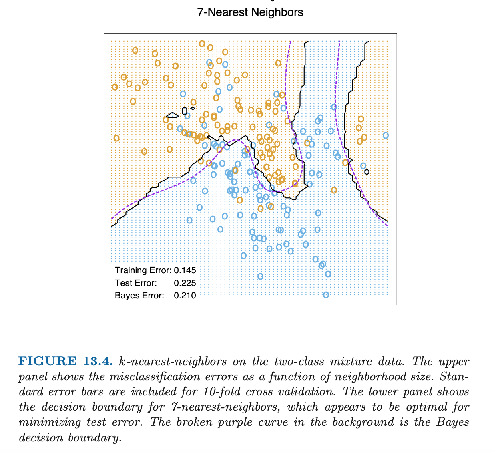
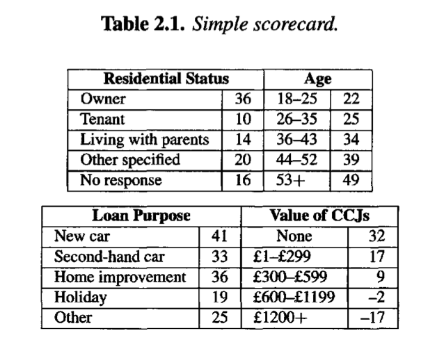

```{r, echo = FALSE, warning = FALSE, message = FALSE}
library(tidyverse)

# when using VS Code instead of RStudio / remove when quarto-ing
if(!grepl("/teaching/Scoring/handouts", getwd(), fixed=TRUE)){
  setwd(paste0(getwd(),"/handouts"))
}
 
```

# A reminder (or not) on Supervised Learning

This an informal overview of Statistical Learning, where we introduce concepts and definitions. For a rigorous introduction see for example the dedicated lesson from [Sébastien Gadat - D3S M1 course on Mathematical Statistics](https://perso.math.univ-toulouse.fr/gadat/files/2012/12/Intro_Stat_Learning.pdf) or [Francis Bach - Learning Theory from First Principles](https://www.di.ens.fr/%7Efbach/ltfp_book.pdf).

## Inputs-Outputs

We follow here the terminology of @hastie2009. The problem: we are given a data set where some variables, denoted as **inputs**[^1], have some influence on one or more **output(s)**[^2].

[^1]: In statistics, inputs are often called the predictors, factors or the independent variables. In machine learning the term features is also used.

[^2]: The outputs are also called responses, labels or dependent variables.

We will denote inputs by the symbol $X$ having values in $\mathrm{X}$ (to explicit things we will consider $\mathrm X$ is $\mathbb R^p$). If $X$ is a vector, its components can be accessed by subscripts $X_j$, $j = 1, . . . , p$.

Outputs will be denoted by $Y$ having value in $\mathrm Y$:

## Supervised learning framework

-   When $\mathrm Y$ is $\mathbb R$, it is a **regression problem**;

-   When $\mathrm Y$ is a discrete set, it is a **classification problem** (for example $\mathrm Y$ is $\{0,1\}$ for binary classification).

In this course we will restrict to the case of **binary classification**.

We need data to construct predictions or classifications. We suppose we have available a set of observed data:

$(x_i, y_i) \in \mathrm X \times \mathrm Y$ , $i = 1, \cdots ,n$, known as the **learning** or **training** set, with which to construct our prediction.

We assume $(x_i, y_i) \in \mathrm X \times \mathrm Y$ are generated i.i.d. from:

$$
\mathbf P_{\mathrm X \times \mathrm Y}
$$

where we denote $\mathbf P_{\mathrm X \times \mathrm Y}$, the data generating distribution (or underlying probability distribution or joint law) which is unknown.

The main goal of supervised learning will be to predict unobserved outputs $y$ given unobserved inputs $x$ using the learning set.

Such new or unobserved data is referred as the **testing** set.

## Loss and Risk

To achieve that goal we try to find a "best" or optimal **classifier** (or prediction function in general):

$$
f: \mathrm X \to \mathrm Y
$$

We first must define some criterion to assess the classifier performance (what is optimal?).

For that purpose we consider a **loss** function $\ell: \mathrm Y \times \mathrm Y \to \mathbb R^+$:

$$
\left\{ \begin{array}{ll} 
    \ell(y,z) > 0 &  \mbox{if } y \neq z\cr
    \ell(y,z) = 0 &  \mbox{if } y = z\cr
\end{array} \right.
$$

$\ell(y,f(x))$ is the loss or cost of predicting $f(x)$ while the true output is $y$.

In the context of binary classification a natural selection for loss is the 0-1 loss:

$$
\ell(y,z)=\mathbf 1_{y \neq z}
$$

We will see later in the course that other losses are used.

We then define the expected **risk** of a prediction function $f$ given the loss $\ell$ as:

$$
\mathrm R(f) = \mathbb{E}[\ell(Y,f(X))]
$$ In the context of binary classification $Y \in \{0,1\}$ and 0-1 loss, we have:

$$
\mathrm R(f) = \mathbb{P}[Y\neq f(X))]
$$

Given a data set $(x_i, y_i) \in \mathrm X \times \mathrm Y$, we also define the empirical risk of a classifier $f$ as:

$$
\hat{\mathrm R}(f) = \frac{1}{n} \sum_i \ell(y_i,f(x_i))
$$

## Bayes classifier

We now define the **Bayes(ian) classifier** $f^*: \mathrm X \to \mathrm Y$ as a function that achieves the minimal expected risk among all possible functions:

$$
\underset{f}{\operatorname{argmin}}\mathrm R(f) 
$$

It is sometimes designed as oracle in the literature.

The Bayes classifier depends on $\ell$ and $\mathbf P_{\mathrm X \times \mathrm Y}$ which is generally unknown (otherwise the job would be easy).

The Bayes classifier for the 0-1 loss is:

$$
f^*(x)=\left\{ \begin{array}{ll} 
    1 &  \mbox{if } \eta(x)\geq \frac{1}{2}\cr
    0 &  \mbox{otherwise}\cr
\end{array} \right.
$$

where:

$$
\eta(x)=\mathbb{P}[Y=1|X=x)] = \mathbb{E}[Y=1|X=x)]
$$

$\eta(x)$ is called the regression function.

::: {.callout-note collapse="true"}
### Proof

Given $f$ a classifier:

Using 0-1 loss definition:

$$
\begin{align*}
\mathrm R(f)  &= \mathbb{E}_{X,Y}[\ell(Y,f(X))] \\
&=\mathbb{E}_{X,Y}[\mathbf 1_{Y=1} \mathbf 1_{f(X)=0} + \mathbf 1_{Y=0} \mathbf 1_{f(X)=1} ] \\
&= \mathbb{E}_{X}[\mathbb{E}_{Y|X}[\mathbf 1_{Y=1} \mathbf 1_{f(X)=0} + \mathbf 1_{Y=0} \mathbf 1_{f(X)=1}|X]]  \\ 
\end{align*}
$$

Using "Tower Rule" conditioning on $X$ then using $\eta(X)$ definition:

$$
\begin{align*}
&= \mathbb{E}_{X}[\mathbb{E}_{Y|X}[\mathbf 1_{Y=1} \mathbf 1_{f(X)=0} + \mathbf 1_{Y=0} \mathbf 1_{f(X)=1}|X]]  \\ 
&= \mathbb{E}_{X}[\mathbf 1_{f(X)=0}\mathbb{E}_{Y|X}[\mathbf 1_{Y=1}] + \mathbf 1_{f(X)=1} \mathbb{E}_{Y|X}[\mathbf 1_{Y=0}|X]] \\
&=\mathbb{E}_{X}[\mathbf 1_{f(X)=0}\eta(X) + \mathbf 1_{f(X)=1} (1-\eta(X))] \\
&=\mathbb{E}_{X}[(1-\mathbf 1_{f(X)=1})\eta(X) + \mathbf 1_{f(X)=1} (1-\eta(X))] \\
&=\mathbb{E}_{X}[(\mathbf 1_{f(X)=1}(1-2\eta(X))] + \mathbb{E}_{X}[\eta(X))] \\
\end{align*}
$$

To minimize the risk with respect to $f$:

-   if $1-2\eta(X) \leq0$ (ie $\eta(X) \geq \frac{1}{2}$), we need $f(X)=1$

-   if $1-2\eta(X) \geq0$ (ie $\eta(X) \leq \frac{1}{2}$), we need $f(X)=0$

It is mostly how was defined $f^*$ before:

$$
f^*(x)=\left\{ \begin{array}{ll} 
    1 &  \mbox{if } \eta(x)\geq \frac{1}{2}\cr
    0 &  \mbox{otherwise}\cr
\end{array} \right.
$$
:::

## Theory vs practice

In practice $\mathbf P_{\mathrm X \times \mathrm Y}$ is unknown. What we have is the learning set. The Bayes classifier minimizes the expected risk but is not a function of the learning set. What to do?

Conceptually two approaches are used[^3]:

[^3]: Here I use a high level explanation which is very elegantly detailed in Sébastien Gadat - TSE - Maths of Deep and Machine Learning course [here](https://perso.math.univ-toulouse.fr/gadat/files/2012/12/Note-25-oct.-2022.pdf); Other good references are Philippe Rigollet - MIT - 18.657: Mathematics of Machine Learning [here](https://ocw.mit.edu/courses/18-657-mathematics-of-machine-learning-fall-2015/81406c87dccb9e873cfafa876a4d69c3_MIT18_657F15_LecNote.pdf) or Erwan Le Pennec - Polytechnique - Introduction to Machine Learning (M2 MSV) [slides here](http://www.cmap.polytechnique.fr/~lepennec/files/MSV/MLMethods_Adv%20-%20MSV%20-%2023.pdf).

-   the "probabilistic" approach: we estimate the regression function $\eta(x)$ and use/plug this estimate "inside" the Bayes classifier (Plugin); within this approach mainly two sub-approaches:

    -   the "discriminative" approach or conditional density modeling: we directly model or make an assumption on $\eta(X)=\mathbf P_{\mathrm Y | \mathrm X}$ and estimate it; for example we can make the assumption that $\eta(x)$ is a function of a particular form.

    -   the "generative" approach: we model the conditional distribution $\mathbf P_{\mathrm X | \mathrm Y}$ and use Bayes formula to get: $\eta(X)=\frac{\mathbb{P}[X|Y=1)]\mathbb{P}[Y=1)]}{\mathbb{P}[X]}=\frac{\mathbb{P}[X|Y=1)]\mathbb{P}[Y=1)]}{\mathbb{P}[X|Y=1)]\mathbb{P}[Y=1)]+\mathbb{P}[X|Y=0)]\mathbb{P}[Y=0)]}$

-   the optimization or "machine learning" approach: finding $f$ minimizing the empirical risk; optimization algorithm or heuristics are used to estimate $f$; the 0-1 loss is not convex so usually it is replaced by a convex surrogate loss or upper bound; usually re-sampling methods are used to compute empirical risk ($f$ is trained on a training set and empirical risk evaluated on the testing set, $f$ is chosen to minimize empirical risk).

We will see later that in the context of the Logistic Regression the two approaches are strongly linked: it can be seen as a probabilistic\|discriminative approach or a optimization approach.

# Illustrative example: the **Mixture** data set

To illustrate what we have seen we use the **Mixture** data set described in @hastie2009 [p. 12-16].

The data set is generated as follows (p. 16):

-   First the authors generate 10 "means" $m_k$ in $\mathbb R^2$ from a bivariate Gaussian distribution $\mathcal{N}((1,0),I)$ and label this class *BLUE*.

-   Similarly, 10 more are drawn from $\mathcal{N}((0,1),I)$ and labeled *ORANGE*.

-   Then for each class authors generate 100 observations as follows: for each observation, $m_k$ is picked at random with probability $\frac{1}{10}$ and used to generate a $\mathcal{N}(m_k,I/5)$, thus leading to a mixture of Gaussian clusters for each class. They generate similarly an additional data set of 5k observations per class for testing purposes.

The task is to create a classifier that, based on the coordinates $x_1$ and $x_2$, determines whether the point is *ORANGE* or *BLUE*.

First we load the data set and plot the "means":

```{r}
# Simulated mixture (ORANGE/BLUE) from ESLII/ISLR
load(file='../data/mixture.example.RData')

x1_means <- mixture.example$means[,1]
x2_means <- mixture.example$means[,2]
mixture_means <- tibble(x1_means, x2_means) %>%
    rowid_to_column() %>%
    mutate(Y = if_else(rowid <= 10, "BLUE", "ORANGE"))

ggplot(mixture_means) + 
    geom_point(aes(x = x1_means, y = x2_means, col = Y), size = 3, show.legend = FALSE) +
    scale_colour_manual(values = c("dodgerblue", "orange")) +
    theme_void()

# saveRDS(mixture_means, "../data/mixture_means.rds")
```

Then the training set together with the "means":

```{r}
Y = mixture.example$y
x1 = mixture.example$x[,1]
x2 = mixture.example$x[,2]
data_mixture_example <- tibble(Y, x1, x2) %>% mutate(Y = as_factor(Y))

ggplot(data_mixture_example) + 
    geom_point(aes(x = x1, y = x2, col = Y), shape = "o", size = 4, stroke = 2, show.legend = FALSE) +
    geom_point(data = mixture_means, aes(x = x1_means, y = x2_means, col =Y), size = 3, show.legend = FALSE) +
    scale_colour_manual(values = c("dodgerblue", "orange", "dodgerblue", "orange")) +
    theme_void()

#saveRDS(data_mixture_example, "../data/data_mixture_example.rds")

```

Knowing the generative distribution, we generate a testing set of size 10k (half BLUE, half ORANGE).

```{r}
# generate new sampling
set.seed(1987)
N <- 10000
draw <- sample(1:10, size=N, replace=TRUE)
x1_blue <- rnorm(N/2) * 1/sqrt(5) + mixture_means[draw[1:(N/2)],2]
x2_blue <- rnorm(N/2) * 1/sqrt(5) + mixture_means[draw[1:(N/2)],3]
x1_orange <- rnorm(N/2) * 1/sqrt(5) + mixture_means[10 + draw[(N/2+1):N],2]
x2_orange <- rnorm(N/2) * 1/sqrt(5) + mixture_means[10 + draw[(N/2+1):N],3]

new_mixture <- rbind(cbind(x1_blue, x2_blue, Y="BLUE"), cbind(x1_orange, x2_orange, Y="ORANGE")) %>%
    as_tibble() %>% 
    rename(x1=x1_means, x2=x2_means)

# head(new_mixture)
```

We plot the first 250 new observations of each class from the generated testing set:

```{r}
ggplot(new_mixture[c(1:250,5001:5251),]) + 
    geom_point(aes(x = x1, y = x2, col = Y), shape = "o", size = 4, stroke = 2, show.legend = FALSE) +
    geom_point(data = mixture_means, aes(x = x1_means, y = x2_means, col =Y), size = 3, show.legend = FALSE) +
    scale_colour_manual(values = c("dodgerblue", "orange", "dodgerblue", "orange")) +
    theme_void()
# saveRDS(new_mixture, "../data/new_mixture.rds")
# new_mixture <- readRDS("../data/new_mixture.rds")
```

## Bayes classifier

Knowing the generating distribution we can derive the Bayes classifier (exercise 2.2 [@hastie2009]).

We plot the boundary decision in grey:

```{r}
# fine grid for predictions/decision boundaries
grid <- expand.grid(x1 = seq(-2.6, 4.2, .01), x2 = seq(-2.0, 2.9, .01)) %>% as_tibble()
# coarse grid for mimicking ESL figures (little dots)
grid_background <- expand.grid(x1 = seq(-2.6, 4.2, .05), x2 = seq(-2.0, 2.9, .05)) %>% as_tibble()

# Prediction function used to classify areas on the grid and imply the decision boundary
# explicit expression for the Bayes decision boundary
predict_oracle <- function(x1, x2){
    obj <- 0
    for(i in 1:10){
       obj <- obj +
           exp(-5/2*((x1-x1_means[i])**2+(x2-x2_means[i])**2)) -
           exp(-5/2*((x1-x1_means[i+10])**2+(x2-x2_means[i+10])**2))
    }
    1 * (obj < 0)
}

predict_oracle_V <- Vectorize(predict_oracle)

grid <- grid %>% mutate(predict_oracle = predict_oracle_V(x1, x2))

grid_background <- grid_background %>% mutate(predict_oracle = predict_oracle_V(x1, x2))

ggplot(grid) + 
geom_contour(aes(x = x1, y = x2, z = predict_oracle),
             breaks = 0.5, col = 'darkgrey') + 
geom_point(data = data_mixture_example, aes(x = x1, y = x2, col = Y),
           shape = "o", size = 4, stroke = 2, show.legend = FALSE) +
geom_point(data = grid_background,
           aes(x = x1, y = x2, col = as.factor(predict_oracle)),
           shape = 20, size = .05, alpha = .5, show.legend = FALSE) +
scale_colour_manual(values = c("dodgerblue", "orange")) +
theme_void()
```

We estimate Bayes risk on the testing data set simulated before (10k BLUE/ORANGE dots) using the data generating process $\mathbf P_{\mathrm X \times \mathrm Y}$.

```{r}
bayes_error_rate <- new_mixture %>%
    mutate(Y = if_else(Y=="BLUE", 0, 1),
           predict_oracle = predict_oracle_V(x1, x2),
           l01 = if_else(Y==predict_oracle, 0, 1))

bayes_test_risk <- bayes_error_rate %>%
    summarise(l01 = mean(l01)) %>% 
        pull(l01)

bayes_error_rate_train <- data_mixture_example %>%
    mutate(Y = if_else(Y=="0", 0, 1),
           predict_oracle = predict_oracle_V(x1, x2),
           l01 = if_else(Y==predict_oracle, 0, 1))

bayes_train_risk <- bayes_error_rate_train %>%
    summarise(l01 = mean(l01)) %>% 
        pull(l01)
```

We get a value of `r round(bayes_test_risk,3)` for the "estimated" Bayes risk, which is in line with [@hastie2009 Figure 13.4], see below:

{fig-align="center" width="700"}

We give below a brief tour showing the decision boundary of common classifiers for the Mixture data set.

## Logistic Regression classifier

We plot below the linear decision boundary given by a Logistic Regression vs Bayes, we only display the training set:

```{r}
# fine grid for predictions/decision boundaries
grid <- expand.grid(x1 = seq(-2.6, 4.2, .01), x2 = seq(-2.0, 2.9, .01)) %>% as_tibble()
# coarse grid for mimicking ESL figures (little dots)
grid_background <- expand.grid(x1 = seq(-2.6, 4.2, .05), x2 = seq(-2.0, 2.9, .05)) %>% as_tibble()

mixture_example_logit <- glm(Y~., data = data_mixture_example, family = "binomial")

grid <- broom::augment(mixture_example_logit,
                       data = data_mixture_example,
                       newdata = grid,
                       type.predict = "response", type.residuals = "deviance") %>% 
    mutate(predict_oracle = predict_oracle_V(x1, x2))

grid_background <- broom::augment(mixture_example_logit, data = data_mixture_example,
               newdata = grid_background, type.predict = "response", type.residuals = "deviance") %>% 
    mutate(predict_glm = 1*(.fitted >= 0.5))

coeffs <- mixture_example_logit$coefficients

glm_boundary <- function(x1){
    -(coeffs[2] * x1 + coeffs[1]) / coeffs[3]
}
glm_boundary_V <- Vectorize(glm_boundary) 

ggplot(grid) + 
geom_contour(aes(x = x1, y = x2, z = predict_oracle),
             breaks = 0.5, col = 'purple') + 
geom_line(aes(x = x1, y = glm_boundary(x1)),col = 'darkgrey') +
geom_point(data = data_mixture_example, aes(x = x1, y = x2, col = Y),
           shape = "o", size = 4, stroke = 2, show.legend = FALSE) +
geom_point(data = grid_background,
           aes(x = x1, y = x2, col = as.factor(predict_glm)),
            shape = 20, size = .05, alpha = .5, show.legend = FALSE) +
scale_colour_manual(values = c("dodgerblue", "orange")) +
theme_void()
```

We add a sample (500 additional observations for each class) of the testing set to the preceding graph:

```{r}
# fine grid for predictions/decision boundaries
grid <- expand.grid(x1 = seq(-2.6, 4.2, .01), x2 = seq(-2.0, 2.9, .01)) %>% as_tibble()
# coarse grid for mimicking ESL figures (little dots)
grid_background <- expand.grid(x1 = seq(-2.6, 4.2, .05), x2 = seq(-2.0, 2.9, .05)) %>% as_tibble()

mixture_example_logit <- glm(Y~., data = data_mixture_example, family = "binomial")

grid <- broom::augment(mixture_example_logit,
                       data = data_mixture_example,
                       newdata = grid,
                       type.predict = "response",
                       type.residuals = "deviance") %>% 
    mutate(predict_oracle = predict_oracle_V(x1, x2))

grid_background <- broom::augment(mixture_example_logit, data = data_mixture_example,
               newdata = grid_background, type.predict = "response", type.residuals = "deviance") %>% 
    mutate(predict_glm = 1*(.fitted >= 0.5))

coeffs <- mixture_example_logit$coefficients

glm_boundary <- function(x1){
    -(coeffs[2] * x1 + coeffs[1]) / coeffs[3]
}
glm_boundary_V <- Vectorize(glm_boundary) 

ggplot(grid) + 
geom_contour(aes(x = x1, y = x2, z = predict_oracle),
             breaks = 0.5, col = 'purple') + 
geom_line(aes(x = x1, y = glm_boundary(x1)),col = 'darkgrey') +
geom_point(data = data_mixture_example, aes(x = x1, y = x2, col = Y),
           shape = "o", size = 4, stroke = 2, show.legend = FALSE) +
geom_point(data = grid_background,
           aes(x = x1, y = x2, col = as.factor(predict_glm)),
            shape = 20, size = .05, alpha = .5, show.legend = FALSE) +
geom_point(data = new_mixture[c(1:500,5001:5501),], aes(x = x1, y = x2, col = Y),
           shape = "o", size = 4, stroke = 2, show.legend = FALSE) +
scale_colour_manual(values = c("dodgerblue", "orange", "dodgerblue", "orange")) +
theme_void()
```

```{r}
logit_error_rate <- broom::augment(mixture_example_logit,
                                   data = data_mixture_example,
                                   newdata = new_mixture,
                                   type.predict = "response",
                                   type.residuals = "deviance") %>% 
                    mutate(Y = if_else(Y == "BLUE", 0, 1),
                           predict_glm = 1*(.fitted >= 0.5),
                           l01 = if_else(Y==predict_glm, 0, 1))

logit_risk <- logit_error_rate %>% summarise(l01 = mean(l01)) %>% pull(l01)
```

The empirical risk on testing set is `r round(logit_risk, 3)`.

## Nonparametric (splines) Logistic Regression classifier

A popular method to move beyond linearity is to transform variables, for example using splines [@hastie2009 5.6 Nonparametric Logistic Regression, p161-164].

This can achieve more flexibility at the decision boundary.

Using natural splines in $x_1$ and $x_2$:

```{r}
library(splines)

## fit additive natural cubic spline model
# Additive Natural Cubic Splines - 4 df each (Fig 5.11 p164)
# fine grid for predictions/decision boundaries
grid <- expand.grid(x1 = seq(-2.6, 4.2, .01), x2 = seq(-2.0, 2.9, .01)) %>% as_tibble()
# coarse grid for mimicking ESL figures (little dots)
grid_background <- expand.grid(x1 = seq(-2.6, 4.2, .05), x2 = seq(-2.0, 2.9, .05)) %>% as_tibble()

mixture_example_glm_splines_add <- glm(Y ~ splines::ns(x1, df=4) + 
                                           splines::ns(x2, df=4),
                                       data = data_mixture_example,
                                       family = "binomial")

grid <- broom::augment(mixture_example_glm_splines_add,
                       data = data_mixture_example,
                       newdata = grid,
                       type.predict = "response",
                       type.residuals = "deviance") %>% 
               mutate(predict_gam = 1*(.fitted >= 0.5),
                      predict_oracle = predict_oracle_V(x1, x2))

grid_background <- broom::augment(mixture_example_glm_splines_add,
                       data = data_mixture_example,
                       newdata = grid_background,
                       type.predict = "response",
                       type.residuals = "deviance") %>% 
               mutate(predict_gam = 1*(.fitted >= 0.5))

ggplot(grid) + 
geom_contour(aes(x = x1, y = x2, z = predict_oracle),
             breaks = 0.5, col = 'purple') + 
geom_contour(aes(x = x1, y = x2, z = predict_gam),
             breaks = 0.5, col = 'darkgrey') + 
geom_point(data = data_mixture_example, aes(x = x1, y = x2, col = Y),
           shape = "o", size = 4, stroke = 2, show.legend = FALSE) +
geom_point(data = grid_background,
           aes(x = x1, y = x2, col = as.factor(predict_gam)),
           shape = 20, size = .05, alpha = .5, show.legend = FALSE) +
scale_colour_manual(values = c("dodgerblue", "orange")) +
theme_void()
```

```{r}
logit_splines_add_error_rate <- broom::augment(mixture_example_glm_splines_add,
                                   data = data_mixture_example,
                                   newdata = new_mixture,
                                   type.predict = "response",
                                   type.residuals = "deviance") %>% 
                                mutate(Y = if_else(Y == "BLUE", 0, 1),
                                       predict_glm = 1*(.fitted >= 0.5),
                                       l01 = if_else(Y==predict_glm, 0, 1))

logit_splines_add_risk <- logit_splines_add_error_rate  %>%
    summarise(l01 = mean(l01)) %>% 
    pull(l01)
```

The empirical risk on testing set is `r round(logit_splines_add_risk, 3)`.

Using the interactions of splines in $x_1$ and $x_2$:

```{r}
## fit additive natural cubic spline model
# Natural Cubic Splines - Tensor Product - 4 df each (Fig 5.11 p164)
# fine grid for predictions/decision boundaries
grid <- expand.grid(x1 = seq(-2.6, 4.2, .01), x2 = seq(-2.0, 2.9, .01)) %>% as_tibble()
# coarse grid for mimicking ESL figures (little dots)
grid_background <- expand.grid(x1 = seq(-2.6, 4.2, .05), x2 = seq(-2.0, 2.9, .05)) %>% as_tibble()

mixture_example_glm_splines_add_tens <- glm(Y ~ splines::ns(x1, df=4) : # interaction x1/x2
                                                splines::ns(x2, df=4)-1,
                                            data = data_mixture_example,
                                            family = "binomial")

grid <- broom::augment(mixture_example_glm_splines_add_tens,
                       data = data_mixture_example,
                       newdata = grid,
                       type.predict = "response",
                       type.residuals = "deviance") %>% 
               mutate(predict_gam = 1*(.fitted >= 0.5),
                      predict_oracle = predict_oracle_V(x1, x2))

grid_background <- broom::augment(mixture_example_glm_splines_add_tens,
                       data = data_mixture_example,
                       newdata = grid_background,
                       type.predict = "response",
                       type.residuals = "deviance") %>% 
               mutate(predict_gam = 1*(.fitted >= 0.5),
                      predict_oracle = predict_oracle_V(x1, x2))

ggplot(grid) + 
geom_contour(aes(x = x1, y = x2, z = predict_oracle),
             breaks = 0.5, col = 'purple') + 
geom_contour(aes(x = x1, y = x2, z = predict_gam),
             breaks = 0.5, col = 'darkgrey') + 
geom_point(data = data_mixture_example, aes(x = x1, y = x2, col = Y),
           shape = "o", size = 4, stroke = 2, show.legend = FALSE) +
geom_point(data = grid_background,
           aes(x = x1, y = x2, col = as.factor(predict_gam)),
           shape = 20, size = .05, alpha = .5, show.legend = FALSE) +
scale_colour_manual(values = c("dodgerblue", "orange")) +
theme_void()
```

```{r}
logit_splines_add_tens_error_rate <- broom::augment(mixture_example_glm_splines_add_tens,
                                   data = data_mixture_example,
                                   newdata = new_mixture,
                                   type.predict = "response",
                                   type.residuals = "deviance") %>% 
                                   mutate(Y = if_else(Y == "BLUE", 0, 1),
                                          predict_glm = 1*(.fitted >= 0.5),
                                          l01 = if_else(Y==predict_glm, 0, 1))

logit_splines_add_tens_risk <- logit_splines_add_tens_error_rate  %>%
    summarise(l01 = mean(l01)) %>% 
    pull(l01)

```

The empirical risk on testing set is `r round(logit_splines_add_tens_risk, 3)`.

## Logistic regression with binning:

It is usual, for example in the context of credit scoring or banking, to discretize or categorize numerical variables (a.k.a binning).

Here we use a simple decile binning on $x_1$ and $x_2$:

```{r}
# fine grid for predictions/decision boundaries
grid <- expand.grid(x1 = seq(-2.6, 4.2, .01), x2 = seq(-2.0, 2.9, .01)) %>% as_tibble()
# coarse grid for mimicking ESL figures (little dots)
grid_background <- expand.grid(x1 = seq(-2.6, 4.2, .05), x2 = seq(-2.0, 2.9, .05)) %>% as_tibble()

breaks_x1 <- c(quantile(data_mixture_example$x1, probs = seq(0, 1, by = 1/10), na.rm = T))
breaks_x1[1] <- -1e8
breaks_x1[length(breaks_x1)] <- 1e8

breaks_x2 <- c(quantile(data_mixture_example$x2, probs = seq(0, 1, by = 1/10), na.rm = T))
breaks_x2[1] <- -1e8
breaks_x2[length(breaks_x2)] <- 1e8

data_binned <- data_mixture_example %>% 
    mutate(x1_bin = cut(x1, breaks = breaks_x1,
                    right = FALSE,
                    dig.lab = 1,
                    ordered_result = TRUE),
           x2_bin = cut(x2, breaks = breaks_x2,
                    right = FALSE,
                    dig.lab = 1,
                    ordered_result = TRUE))

grid <- grid %>% 
    mutate(x1_bin = cut(x1, breaks = breaks_x1,
                    right = FALSE,
                    dig.lab = 1,
                    ordered_result = TRUE),
           x2_bin = cut(x2, breaks = breaks_x2,
                    right = FALSE,
                    dig.lab = 1,
                    ordered_result = TRUE))

grid_background <- grid_background %>% 
    mutate(x1_bin = cut(x1, breaks = breaks_x1,
                    right = FALSE,
                    dig.lab = 1,
                    ordered_result = TRUE),
           x2_bin = cut(x2, breaks = breaks_x2,
                    right = FALSE,
                    dig.lab = 1,
                    ordered_result = TRUE))

# from https://search.r-project.org/R/refmans/base/html/cut.html
# x1_labs <- levels(data_binned$x1_bin)
# x2_labs <- levels(data_binned$x2_bin)

#(,] 
# cbind(lower = as.numeric( sub("\\((.+),.*", "\\1", x1_labs) ),
#       upper = as.numeric( sub("[^,]*,([^]]*)\\]", "\\1", x1_labs) ))

#[,)
# x1_bounds <- bind_cols(lower = as.numeric( sub("\\[(.+),.*", "\\1", x1_labs) ),
                # upper = as.numeric( sub("[^,]*,([^\\)]*)(\\)|])", "\\1", x1_labs) ))

mixture_example_glm_binned <- glm(Y ~ x1_bin + x2_bin,
                                            data = data_binned,
                                            family = "binomial")

grid <- broom::augment(mixture_example_glm_binned,
                       data = data_binned,
                       newdata = grid,
                       type.predict = "response",
                       type.residuals = "deviance") %>% 
               mutate(predict_glm_binned = 1*(.fitted >= 0.5),
                      predict_oracle = predict_oracle_V(x1, x2))

grid_background <- broom::augment(mixture_example_glm_binned,
                       data = data_binned,
                       newdata = grid_background,
                       type.predict = "response",
                       type.residuals = "deviance") %>% 
               mutate(predict_glm_binned = 1*(.fitted >= 0.5),
                      predict_oracle = predict_oracle_V(x1, x2))

ggplot(grid) + 
geom_contour(aes(x = x1, y = x2, z = predict_oracle),
             breaks = 0.5, col = 'purple') + 
geom_contour(aes(x = x1, y = x2, z = predict_glm_binned),
             breaks = 0.5, col = 'darkgrey') + 
geom_point(data = data_mixture_example, aes(x = x1, y = x2, col = Y),
           shape = "o", size = 4, stroke = 2, show.legend = FALSE) +
geom_point(data = grid_background,
           aes(x = x1, y = x2, col = as.factor(predict_glm_binned)),
           shape = 20, size = .05, alpha = .5, show.legend = FALSE) +
scale_colour_manual(values = c("dodgerblue", "orange")) +
theme_void()
```

```{r}
new_mixture_binned <- new_mixture %>% 
    mutate(x1_bin = cut(x1, breaks = breaks_x1,
                    right = FALSE,
                    dig.lab = 1,
                    ordered_result = TRUE),
           x2_bin = cut(x2, breaks = breaks_x2,
                    right = FALSE,
                    dig.lab = 1,
                    ordered_result = TRUE))


logit_binned_error_rate <- broom::augment(mixture_example_glm_binned,
                                   data = data_binned,
                                   newdata = new_mixture_binned,
                                   type.predict = "response",
                                   type.residuals = "deviance") %>% 
                                mutate(Y = if_else(Y == "BLUE", 0, 1),
                                       predict_glm = 1*(.fitted >= 0.5),
                                       l01 = if_else(Y==predict_glm, 0, 1))

logit_binned_risk <- logit_binned_error_rate  %>%
    summarise(l01 = mean(l01)) %>% 
    pull(l01)
```

The empirical risk on testing set is `r round(logit_binned_risk, 3)`.

## K-Nearest Neighbors Algorithm

k-NN is a non-parametric algorithm. Given a new observation, it finds in the training set the k closest points (given a certain distance) and predicts using a majority vote.

We show below the boundary decision for $k=15$:

```{r}
library(class)
k <- 15

# fine grid for predictions
grid <- expand.grid(x1 = seq(-2.6, 4.2, .01), x2 = seq(-2.0, 2.9, .01)) %>% as_tibble()
# coarse grid for mimicking ESL figures
grid_background <- expand.grid(x1 = seq(-2.6, 4.2, .05), x2 = seq(-2.0, 2.9, .05)) %>% as_tibble()

# Normalize using boundaries of training sample
normalize <- FALSE # TRUE (pred error 0.259) / FALSE (pred error 0.2498)

if (normalize) {
    
    min1 <- min(data_mixture_example$x1)
    min2 <- min(data_mixture_example$x2)
    max1 <- max(data_mixture_example$x1)
    max2 <- max(data_mixture_example$x2)
    
    train_mixture <- data_mixture_example %>% 
        mutate(x1 = (x1 - min1) / (max1 - min1),
               x2 = (x2 - min2) / (max2 - min2)) %>% 
        select(x1, x2)
    
    test_grid_mixture <- grid %>% 
        mutate(x1 = (x1 - min1) / (max1 - min1),
               x2 = (x2 - min2) / (max2 - min2)) %>% 
        select(x1, x2)
    
    test_new_mixture <- new_mixture %>% 
        mutate(x1 = (x1 - min1) / (max1 - min1),
               x2 = (x2 - min2) / (max2 - min2)) %>% 
        select(x1, x2)
    
} else {
    
    train_mixture <- data_mixture_example %>%
        select(x1,x2)
    
    # For boundary decision (fine grid)
    test_grid_mixture <- grid %>%
          select(x1,x2)
    
    # For background (coarse grid)
    background_grid_mixture <- grid_background %>%
          select(x1,x2)
    
    test_new_mixture <- new_mixture %>%
        select(x1,x2)
    
}

mixture_example_knn <- knn(train_mixture, #train X
                           test_new_mixture, # test X
                           data_mixture_example %>% pull(Y), # train Y
                           k)

table_test <- table(mixture_example_knn,
                     new_mixture %>% # test Y
                        mutate(Y = as_factor(if_else(Y == "BLUE", 0, 1))) %>%
                        pull(Y))

mixture_example_knn <- knn(train_mixture, #train X
                           train_mixture, # test X = train X
                           data_mixture_example %>% pull(Y), # train Y
                           k)


table_train <- table(mixture_example_knn,
      data_mixture_example %>% pull(Y))


mixture_example_knn <- knn(train_mixture, #train X
                           test_grid_mixture, # test X = fine grid for boundary plot
                           data_mixture_example %>% pull(Y), # train Y
                           k)

mixture_example_knn_bg <- knn(train_mixture, #train X
                           background_grid_mixture, # test X = "dotted" grid for plot
                           data_mixture_example %>% pull(Y), # train Y
                           k)
    

grid <- bind_cols(grid, predict_knn = mixture_example_knn) %>%
    mutate(predict_knn = if_else(mixture_example_knn=='0', 0, 1),
           predict_oracle = predict_oracle_V(x1, x2))

grid_background <- bind_cols(grid_background, predict_knn = mixture_example_knn_bg) %>%
    mutate(predict_knn = if_else(mixture_example_knn_bg=='0', 0, 1))

ggplot(grid) + 
geom_contour(aes(x = x1, y = x2, z = predict_oracle),
             breaks = 0.5, col = 'purple') +
geom_contour(aes(x = x1, y = x2, z = predict_knn),
             breaks = 0.5, col = 'darkgrey') + 
geom_point(data = data_mixture_example, aes(x = x1, y = x2, col = Y),
           shape = "o", size = 4, stroke = 2, show.legend = FALSE) +
geom_point(data = grid_background, aes(x = x1, y = x2, col = as.factor(predict_knn)),
           shape = 20, size = .05, alpha = .5, show.legend = FALSE) +
scale_colour_manual(values = c("dodgerblue", "orange")) +
theme_void()
```

```{r}
knn_error_rate <- (table_test[[2]] + table_test[[3]]) /
(table_test[[1]] + table_test[[2]] + table_test[[3]] + table_test[[4]])
```

The empirical risk on testing set is `r round(knn_error_rate, 3)`.

We show below the boundary decision for $k=7$:

```{r}
library(class)
k <- 7

# fine grid for predictions
grid <- expand.grid(x1 = seq(-2.6, 4.2, .01), x2 = seq(-2.0, 2.9, .01)) %>% as_tibble()
# coarse grid for mimicking ESL figures
grid_background <- expand.grid(x1 = seq(-2.6, 4.2, .05), x2 = seq(-2.0, 2.9, .05)) %>% as_tibble()

# Normalize using boundaries of training sample
normalize <- FALSE # TRUE (pred error 0.259) / FALSE (pred error 0.2498)

if (normalize) {
    
    min1 <- min(data_mixture_example$x1)
    min2 <- min(data_mixture_example$x2)
    max1 <- max(data_mixture_example$x1)
    max2 <- max(data_mixture_example$x2)
    
    train_mixture <- data_mixture_example %>% 
        mutate(x1 = (x1 - min1) / (max1 - min1),
               x2 = (x2 - min2) / (max2 - min2)) %>% 
        select(x1, x2)
    
    test_grid_mixture <- grid %>% 
        mutate(x1 = (x1 - min1) / (max1 - min1),
               x2 = (x2 - min2) / (max2 - min2)) %>% 
        select(x1, x2)
    
    test_new_mixture <- new_mixture %>% 
        mutate(x1 = (x1 - min1) / (max1 - min1),
               x2 = (x2 - min2) / (max2 - min2)) %>% 
        select(x1, x2)
    
} else {
    
    train_mixture <- data_mixture_example %>%
        select(x1,x2)
    
    # For boundary decision (fine grid)
    test_grid_mixture <- grid %>%
          select(x1,x2)
    
    # For background (coarse grid)
    background_grid_mixture <- grid_background %>%
          select(x1,x2)
    
    test_new_mixture <- new_mixture %>%
        select(x1,x2)
    
}

mixture_example_knn <- knn(train_mixture, #train X
                           test_new_mixture, # test X
                           data_mixture_example %>% pull(Y), # train Y
                           k)

table_test <- table(mixture_example_knn,
                     new_mixture %>% # test Y
                        mutate(Y = as_factor(if_else(Y == "BLUE", 0, 1))) %>%
                        pull(Y))

mixture_example_knn <- knn(train_mixture, #train X
                           train_mixture, # test X = train X
                           data_mixture_example %>% pull(Y), # train Y
                           k)


table_train <- table(mixture_example_knn,
      data_mixture_example %>% pull(Y))


mixture_example_knn <- knn(train_mixture, #train X
                           test_grid_mixture, # test X = fine grid for boundary plot
                           data_mixture_example %>% pull(Y), # train Y
                           k)

mixture_example_knn_bg <- knn(train_mixture, #train X
                           background_grid_mixture, # test X = "dotted" grid for plot
                           data_mixture_example %>% pull(Y), # train Y
                           k)
    

grid <- bind_cols(grid, predict_knn = mixture_example_knn) %>%
    mutate(predict_knn = if_else(mixture_example_knn=='0', 0, 1),
           predict_oracle = predict_oracle_V(x1, x2))

grid_background <- bind_cols(grid_background, predict_knn = mixture_example_knn_bg) %>%
    mutate(predict_knn = if_else(mixture_example_knn_bg=='0', 0, 1))

ggplot(grid) + 
geom_contour(aes(x = x1, y = x2, z = predict_oracle),
             breaks = 0.5, col = 'purple') +
geom_contour(aes(x = x1, y = x2, z = predict_knn),
             breaks = 0.5, col = 'darkgrey') + 
geom_point(data = data_mixture_example, aes(x = x1, y = x2, col = Y),
           shape = "o", size = 4, stroke = 2, show.legend = FALSE) +
geom_point(data = grid_background, aes(x = x1, y = x2, col = as.factor(predict_knn)),
           shape = 20, size = .05, alpha = .5, show.legend = FALSE) +
scale_colour_manual(values = c("dodgerblue", "orange")) +
theme_void()
```

```{r}
knn_error_rate <- (table_test[[2]] + table_test[[3]]) /
(table_test[[1]] + table_test[[2]] + table_test[[3]] + table_test[[4]])
```

The empirical risk on testing set is `r round(knn_error_rate, 3)`.

We vary $k$ and show the empirical risks on training and testing sets together with Bayes risk:

```{r}
K = seq(100,1,-1)

misclass_curve <- list()

for (k in K){
    
    knn_test <- knn(train_mixture, #train X
                    test_new_mixture, # test X
                    data_mixture_example %>% pull(Y), # train Y
                    k)
    
    knn_train <- knn(train_mixture, #train X
                     train_mixture, # test X = train X
                     data_mixture_example %>% pull(Y), # train Y
                     k)
    
    table_test <- table(knn_test,
                        new_mixture %>% # test Y
                        mutate(Y = as_factor(if_else(Y == "BLUE", 0, 1))) %>%
                        pull(Y))

    test_error <- (table_test[[2]] + table_test[[3]]) / 
        (table_test[[1]] + table_test[[2]] + table_test[[3]] + table_test[[4]])
    
    table_train <- table(knn_train,
          data_mixture_example %>% pull(Y))

    train_error <- (table_train[[2]] + table_train[[3]]) / 
        (table_train[[1]] + table_train[[2]] + table_train[[3]] + table_train[[4]])
    
    misclass_curve[[k]] <- tibble(`k - Number of Nearest Neighbours` = k,
                                  `KNN train` = train_error,
                                  `KNN test` = test_error)
    
}

misclass_plot <- bind_rows(misclass_curve) %>% 
    mutate(`Bayes test` = bayes_test_risk,
           `Bayes train` = bayes_train_risk) %>% 
    pivot_longer(-`k - Number of Nearest Neighbours`,
                 names_to = "Model data",
                 values_to = "Prediction Error")
```

```{r, message = FALSE}
library(scales)

ggplot(misclass_plot) +
geom_line(aes(x = `k - Number of Nearest Neighbours`,
              y = `Prediction Error`,
              col = as.factor(`Model data`))) +
    scale_x_continuous(
        trans = scales::compose_trans("log10", "reverse"),
        breaks = c(100, 50, 15, 3, 1)) +
scale_colour_manual(values = c("purple", "green", "orange", "dodgerblue")) +
theme_bw() +
labs(col = NULL)

```

## Decision Trees (CART)

To finish our tour, we show the result of a recursive partition of the plan using Decision Trees techniques:

```{r}
library(rpart)
library(rpart.plot) 

# fine grid for predictions
grid <- expand.grid(x1 = seq(-2.6, 4.2, .01), x2 = seq(-2.0, 2.9, .01)) %>% as_tibble()
# coarse grid for mimicking ESL figures
grid_background <- expand.grid(x1 = seq(-2.6, 4.2, .05), x2 = seq(-2.0, 2.9, .05)) %>% as_tibble()

mixture_example_CART <- rpart(Y~., data = data_mixture_example, method = "class")

grid <- bind_cols(grid,
                  as_tibble(predict(mixture_example_CART, newdata = grid))) %>%
                    select(-`0`) %>% 
                    rename(predict_CART = `1`) %>% 
                    mutate(predict_CART = 1*(predict_CART >= 0.5),
                    predict_oracle = predict_oracle_V(x1, x2))

grid_background <- bind_cols(grid_background,
                    as_tibble(predict(mixture_example_CART, newdata = grid_background))) %>%
                    select(-`0`) %>% 
                    rename(predict_CART = `1`) %>% 
                    mutate(predict_CART = 1*(predict_CART >= 0.5),
                    predict_oracle = predict_oracle_V(x1, x2))

# rpart.plot(mixture_example_CART)
# using nicer low-level function prp to change nodes color / labels etc
mixture_example_CART_plot <- rpart(Y~.,
                                   data = data_mixture_example %>%
                                          mutate(Y = if_else(Y=="0", "BLUE", "ORANGE")),
                                   method = "class")
prp(mixture_example_CART_plot, type = 2, extra = 4, fallen.leaves = TRUE, 
    box.col = c("dodgerblue", "orange")[mixture_example_CART$frame$yval],
    # we indicate both Class 0-1 probabilities and number of observations for each node
    node.fun = function(x, labs, digits, varlen) paste(labs, "\n", "B/O: ", x$frame$yval2[,2], " - ", x$frame$yval2[,3]))
```

```{r}
ggplot(grid) + 
geom_contour(aes(x = x1, y = x2, z = predict_oracle),
             breaks = 0.5, col = 'purple') + 
geom_contour(aes(x = x1, y = x2, z = predict_CART),
             breaks = 0.5, col = 'darkgrey') + 
geom_point(data = data_mixture_example, aes(x = x1, y = x2, col = Y),
           shape = "o", size = 4, stroke = 2, show.legend = FALSE) +
geom_point(data = grid_background,
           aes(x = x1, y = x2, col = as.factor(predict_CART)),
               shape = 20, size = .05, alpha = .5, show.legend = FALSE) +
scale_colour_manual(values = c("dodgerblue", "orange")) +
theme_void()
```

```{r}
cart_error_rate <- bind_cols(new_mixture,
                          tibble(class = predict(mixture_example_CART,
                                                 newdata = new_mixture,
                                                 type = "class")),
                          tibble(prob = predict(mixture_example_CART,
                                                 newdata = new_mixture,
                                                 type = "prob")[, 2])) %>%
                        #  as_tibble()) %>% 
                        mutate(Y = if_else(Y == "BLUE", 0, 1),
                               l01 = if_else(Y==class, 0, 1))
cart_risk <- cart_error_rate  %>%
    summarise(l01 = mean(l01)) %>% 
    pull(l01)
```

The empirical risk on testing set is `r round(cart_risk, 3)`.

To play further and make nicer animated 2D decision boundaries for binary classifiers see these two blogs [here](https://mathformachines.com/posts/decision/) and [here](https://paulvanderlaken.com/2020/01/20/animated-machine-learning-classifiers/). Please also note that the `scikit-learn` `Python` library implements methods to display [decision boundaries for classifiers](https://scikit-learn.org/stable/modules/generated/sklearn.inspection.DecisionBoundaryDisplay.html).

# Scoring

At last we come to the subject of our course!

We remind we are in the context of binary classification.

Often we (and the business) are more interested in estimating the probabilities that $Y$ belongs to each class.

Quoting Trevor Hastie: "For example, it is more valuable to have an estimate of the probability that an insurance claim is fraudulent, than a classification fraudulent or not." This applies to many uses cases:

-   propensity score: is a customer interested by a product or service ? will the user click on the ad?

-   behavioral score: may a customer encounter a delinquency, a bankruptcy ?

-   application score: is the bank ready to grant a loan or a credit card to a customer to authorize a given transaction ?

-   churn score: will a newly acquired customer stay long enough for the account to be profitable ?

-   fraud score : is an application or a transaction fraudulent?

Scoring has business implications and is used as a decision tool for risk assessment or costs reduction:

-   improve the rate of return of marketing campaigns : reach more receptive customers without increasing the number of mailings or reach as many receptive customers with smaller mailings

-   improve efficiency of credit decisions : treat faster customers with low score and concentrate attention on customers with medium score

-   increase homogeneity of decisions across sales managers, and across applications

-   reduce the number of overdue

-   also used for pricing (adapt price to risk)

Before teaching this course I understood "Scoring" as applied classification with business perspective (i.e. Credit scoring for banks).

But we will see that this is more subtle than that, and that there is a precise definition of Scoring.

We follow in the rest of the section the terminology of @cornillon2019 [chapter 11.6 "Prévision - scoring"].

## Scoring function or Score

The aim of Scoring is to find a Scoring function or Score $S: \mathbb R^p \to \mathbb R$ that is "high" in case $\mathbb{P}[Y=1|X=x)$ is "high" and "low" in case $\mathbb{P}[Y=0|X=x)$ is "high".

We say that $S(x)$ is the score of the observation $x \in \mathbb R^p$.

We show below a simplified example of a credit scorecard that were typically used by banks to assess the creditworthiness of consumer loans applicants (as shown in [@scoringThomas]):

{fig-align="center" width="350"}

In this example a 35-year-old owner wishing to borrow money for home improvement and that has never had a county court judgement (CCJ) will score $129 = (36+25+36+32)$, while a 20-year-old living with his parents borrowing for holiday and having more than £1200 of CCJ will score $38=(22+14+19-17)$.

Some remarks:

-   the notions of Score and classifier are closely linked. Given a Score $S$ and a cutoff $s \in \mathbb R$ we obtain the following classifier:

$$
f_s(x)=\left\{ \begin{array}{ll} 
    1 &  \mbox{if } S(x)\geq s\cr
    0 &  \mbox{otherwise}\cr
\end{array} \right.
$$

-   The values taken by $S(x)$ are less important than the way they will order a set of observation $x_1,...x_n$. For any $\phi: \mathbb R \to \mathbb R$ bijective and increasing function, we say that the scores $S$ and $\phi \circ S$ are equivalent.

-   We defined above, in the context of supervised learning, the regression function $\eta(x)=\mathbb{P}[Y=1|X=x)]$. It is a natural candidate for a Scoring function. The related Bayes classifier uses $s=\frac{1}{2}$ as cutoff. As we have just seen in the last sections, $\eta(x)$ is unknown and we will have to approximate or estimate this regression function using the training set.

## Performance

There are many ways to assess the performance of a Score.

We first define the **confusion matrix**:

|       | $f_s(X)=0$ | $f_s(X)=1$ |     |
|:------|:----------:|:----------:|:---:|
| $Y=0$ |     TN     |     FP     |  N  |
| $Y=1$ |     FN     |     TP     |  P  |

: {.bordered}

The [confusion matrix](https://en.wikipedia.org/wiki/Confusion_matrix) is a contingency table which cross-tabulates $Y$ with the predicted one $f_s(X)$.

It can be evaluated on the learning set as well as on the testing set.

The following vocabulary originates from medical applications:

-   true positive (TP)

-   true negative (TN),

-   false positive (FP), also Type I error

-   false negative (FN), also Type II error

More formally we define for a given cutoff $s$:

$$
\alpha(s)=\mathbf P(f_s(X)=1|Y=0)=P(S(X) \geq s|Y=0)
$$

and

$$
\beta(s)=\mathbf P(f_s(X)=0|Y=1)=P(S(X) < s|Y=1)
$$

$\alpha(s)$ is called **false positive** rate and $\beta(s)$ **false negative** rate. Similarly **specificity** and **sensitivity** are defined:

$$
sp(s)=P(S(X) < s|Y=0) = 1 - \alpha(s)
$$

and

$$
se(s)=P(S(X) \geq s|Y=1) = 1 - \beta(s)
$$

The ROC (Receiver Operating Characteristic) curve allows to visualize $\alpha$ and $\beta$ on a same graph for all $s$ allowing to choose the cutoff and compare different Scores.

Precisely, the ROC curve of a Score $S$ is a parametric curve of the variable $s$:

$$
\begin{array}{ll} 
    ROC:&\mathbb R \to [0,1]^2 \cr
        & s \to (x(s)=\alpha(s),y(s)=1-\beta(s))\cr
\end{array}
$$

For a given Score $S$, the ROC curve passes through the points $(0,0)$ and $(1,1)$, which corresponds to classifying all observations as $0$ ($s\to \infty$) or $1$ ($s\to -\infty$).

We now define two special cases:

A Score $S$ is said to be **perfect** if $s^*$ exists such that:

$$
P(Y=1|S(X) \geq s^*) = 1
$$ and $$
P(Y=0|S(X) < s^*) = 1
$$

It corresponds to $x(s^*)=0$ and $y(s^*)=1$ (using the preceding definitions and Bayes rule).

For example:

$$
x(s^*)=P(S(X) \geq s^*|Y=0)=\frac{P(Y=0|S(X) \geq s^*)P(S(X) \geq s^*)}{P(Y=0)}=0
$$

Similarly: for $s \leq s^*$ we have $x(s)=0$ and for $s > s^*$ we have $y(s)=1$.

A score $S$ is said to be **random** if $S(X)$ and $Y$ are independent. In such case:

$$
x(s)=P(S(X) \geq s|Y=0)=P(S(X))=P(S(X) \geq s|Y=1)=y(s)
$$

The ROC curve for a random score is the first bisector $(0,0)$ to $(1,1)$.

@fig-roc-perfect-random shows the two curves.

```{r, warning=FALSE}
#| label: fig-roc-perfect-random
#| fig-cap: "ROC curves of a perfect Score (solid, blue) and a random Score (dashed, orange)"


perfect_score_label = "s=s^{\\*}"
temp <- expression("s="~rho == 0.34)

ggplot() +
    geom_segment(aes(x = 0, y = 0, xend = 0, yend = 1), col="dodgerblue", linewidth = 2) + # perfect score vert
    geom_segment(aes(x = 0, y = 1, xend = 1, yend = 1), col="dodgerblue", linewidth = 2) + # perfect score horiz
    geom_segment(aes(x = 0, y = 0, xend = 1, yend = 1), col="orange", linetype = 2, linewidth = 1.5) + # random score
    # annotate perfect score
    annotate("segment", x = 0.05, y = 0.95, xend = 0, yend = 1,
             arrow = arrow(type = "closed", length = unit(0.02, "npc"))) +
    annotate("text", x=0.08,y=0.92, label = 's == "s*"', parse=TRUE) +
    # -Inf
    annotate("segment", x = 0.95, y = 0.95, xend = 1, yend = 1,
             arrow = arrow(type = "closed", length = unit(0.02, "npc")))+
    annotate("text", x=0.92,y=0.92, label = expression(s==-infinity), parse=TRUE) +
    # +Inf
    annotate("segment", x = 0.05, y = 0.05, xend = 0, yend = 0,
             arrow = arrow(type = "closed", length = unit(0.02, "npc")))+
    annotate("text", x=0.08,y=0.08, label = expression(s==infinity), parse=TRUE) +
    coord_cartesian(xlim = c(0, 1), ylim = c(0, 1), expand = FALSE) +
    labs(x = "false positives", y = "true positives") +
    theme_bw() 

```

The ROC curves can be summarized to generate numeric criteria such as the AUC (Area Under Curve).

The AUC will be $1$ for the perfect Score and $0.5$ for the random Score and can be used to rapidly compare two Scores.

It is considered better than other point-wise criteria.

However we must keep in mind that the AUC as a summary criterion presents some drawbacks since two Scores can have the same AUC but behave very differently in the plane.

In practice we do not know the probabilities $x(s)$ and $y(s)$ to define the ROC curve.

As said before, a training set will be used to learn a Score $S$ and a testing set to estimate the ROC curve $x(s)$ and $y(s)$ for a range of $s$.

In the rest of the course we will be equally interested in binary classification and scoring which are closely linked.

Throughout the course, we will focus on two fundamental and complementary models: the Logistic Regression model and Decision Trees.

Logistic Regression adopts a "probabilistic\|discriminative" approach to model with a parametric law the conditional probability $Y|X$ and then estimate the parameters of the regression function.

On the other hand, Decision Trees adopt a "machine learning" approach, aiming to minimize empirical risk.

These two models serve as the foundation elements for modern machine learning algorithm, making them essential components of the classification/scoring toolkit.

Moreover these two methods can be combined, see for example this [2020 blog post from Criteo engineering team on combining Logistic Regression and Decision Trees in production](https://medium.com/criteo-engineering/unity-is-strength-a-story-of-model-composition-49748b1f1347).

# Exercises

## ROC curves

Using the Mixture data set, plot ROC curves for some chosen classifiers:

- first by implementing from scratch a method for plotting ROC curves using the course definition:

For a given threshold $s$ and passing as argument a column of outputs $Y$ together with a score column (i.e. predicted probabilities) define a function to obtain the False/True Positive Rates:

```{r}
#| code-fold: show
roc_curve <- function(s, error_rate){
    # error_rate is a tibble containing a column Y of true values and a column score 
    
    # let s be a threshold in R
    # YOUR CODE HERE
    
    return(tibble(threshold = s, fpr = false_positive_rate, tpr = true_positive_rate))
}
```

First use this function to plot the ROC curve (passing a vector of thresholds $s$) for a Logistic Regression classifier defined and fitted in the first section of the course:

```{r}
#| code-fold: show
# YOUR CODE HERE

```

Then use it to plot the ROC curve for a Logistic Regression classifier using predictors modified using splines:

```{r}
#| code-fold: show
# YOUR CODE HERE

```

Then use it to plot the ROC curve for a Logistic Regression classifier using discretized quantitative predictors (binning):

```{r}
#| code-fold: show
# YOUR CODE HERE
```

To finish show the ROC curve for a Decision Tree method:

```{r}
#| code-fold: show
# YOUR CODE HERE

```

Plot the ROC curves together:

```{r}
#| code-fold: show
# YOUR CODE HERE

```

- Do the same using the `ROCR` package (see `ROCR_Talk_Tobias_Sing.ppt` in course repository for a presentation by its authors)

The library `ROCR` needs to first build a `prediction` object using a column of outputs $Y$ together with a score column (i.e. predicted probabilities), then to build a `performance` object (for a ROC curve the arguments `measure = "tpr", x.measure = "fpr"` should be passed to `performance()` together with the `prediction` object / for the AUC the argument `measure = "auc"` should be passed to `performance()` together with the `prediction` object)

Obtain the same curves as before:

```{r}
#| code-fold: show
# ROC Curves with ROCR
library("ROCR")    
# YOUR CODE HERE
```

## Bayes classifier (Exercise 11.9 @cornillon2019)

Considering a pair of random variables $(X, Y)$ taking values in $\mathbb R\times\{0,1\}$ with:

$X\sim\mathcal U[-2,2]$\text{,}\quad $U\sim\mathcal U[0,10]$

and:

$$\begin{aligned}
Y|X=x  & =\left\{
\begin{array}{ll}
\mathbf 1_{U\leq2}  & \textrm{if } x\leq 0 \\
\mathbf 1_{U>1}  & \textrm{if } x>0
\end{array}\right.
\end{aligned}$$
where $\mathcal U[a, b]$ denotes the uniform distribution on $[a,b]$ and $X$ and $U$ are assumed to be independent.

Calculate the Bayes classifier and the Bayes risk.

## Other simulated data sets

Simulate other toy data sets, and plot decision boundaries. For example:

- Data set 1:

  - Class 0: mixture of $\mu_{0a}=\begin{bmatrix} 1 \\ 4 \end{bmatrix}$, $\mu_{0b}=\begin{bmatrix} 1 \\ -4 \end{bmatrix}$ $\Sigma_{0a}=\Sigma_{0b}=\begin{bmatrix} 2 & 0 \\ 0 & 2 \end{bmatrix}$
  - Class 1: $\mu_{1}=\begin{bmatrix} 4 \\ 0 \end{bmatrix}$ $\Sigma_{1}=\begin{bmatrix} 2 & 0 \\ 0 & 4 \end{bmatrix}$

- Data set 2 (using a "generative" approach, with same assumptions as QDA): Given $\mu_0$, $\mu_1$, $\Sigma_0$ and $\Sigma_1$ and $X$ having values in $\mathbb R^2$:

  - $X|Y=0 \sim\mathcal N[\mu_0,\Sigma_0]$,

  - $X|Y=1 \sim\mathcal N[\mu_1,\Sigma_1]$ and $\mathbb{P}[Y=1]=\pi$

# References

::: {#refs}
:::
